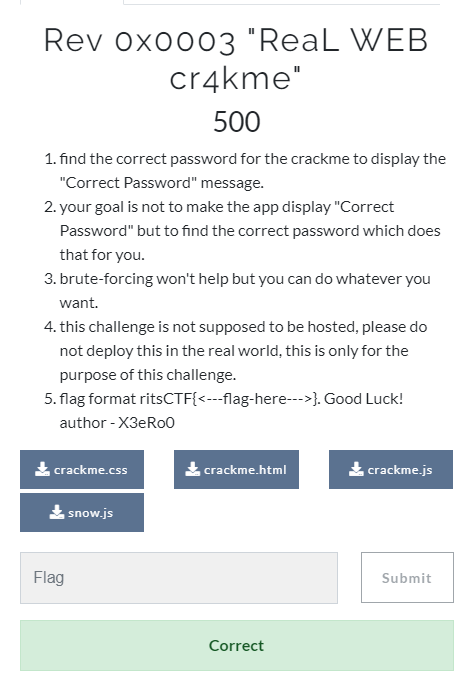
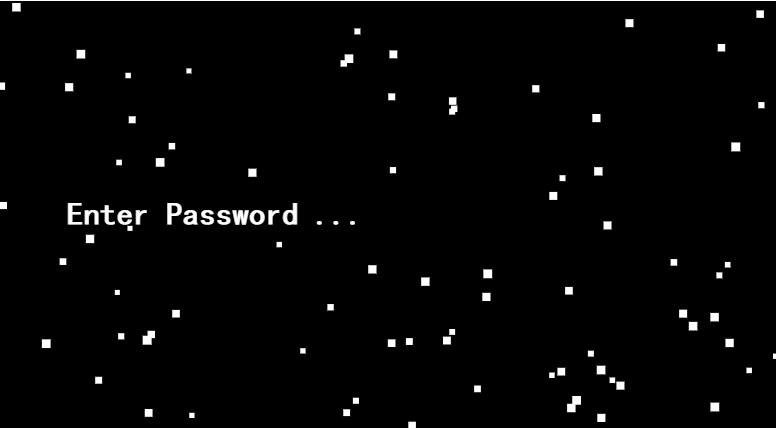
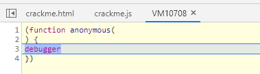
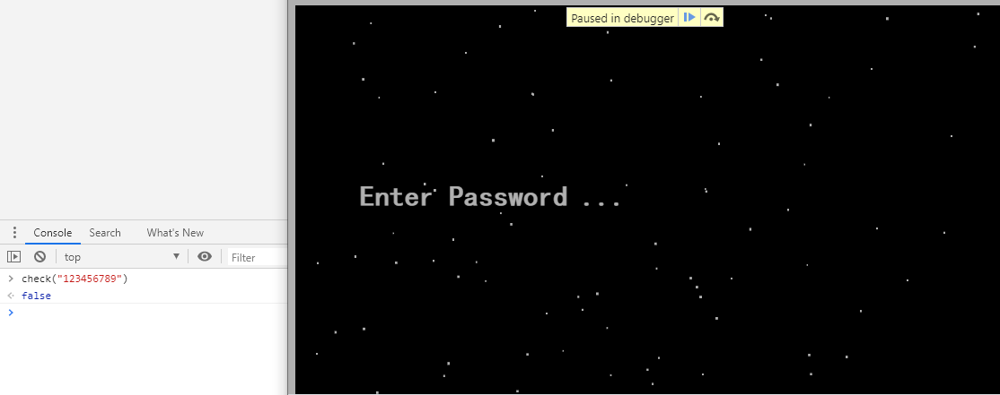
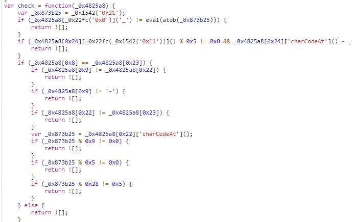
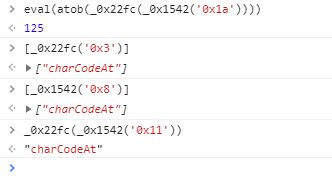
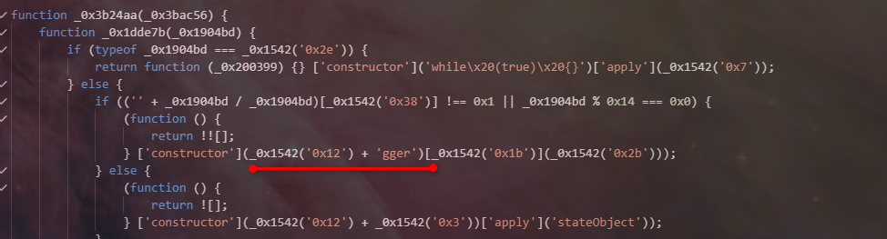
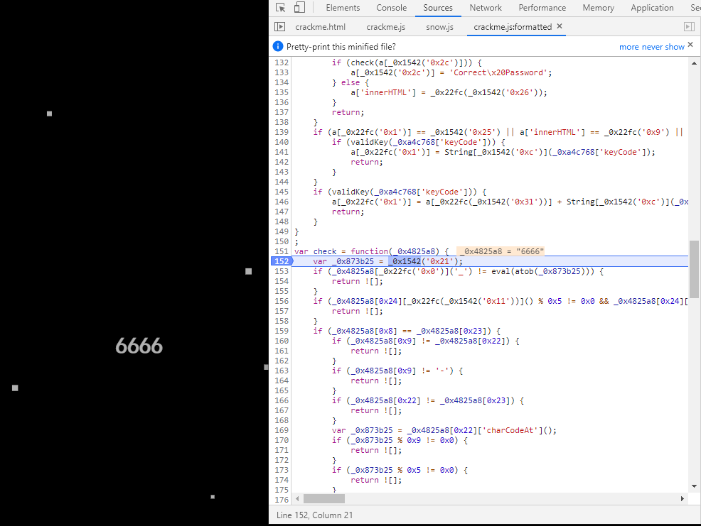

###     0x0     概述
近期在riftCTF上有一道逆向题，涉及到web前端反调试。
题目如下
{}

{}

###     0x1     开始
下载四个附件后，用游览器打开crackme.html
{}

{}
输入字符串后会有两个结果
-   字符串与flag一致，提示correct password
-   否则显示wrong password

除了crackme.js以外的文件，比较简单，没有一些相关信息，直接看crackme.js

大致源码分析了下，基本上比对flag的代码集中在crackme.js
核心代码在于

```js
eval(atob("dmFyIF8weDUwZmQ9WycweDInLCdleGNlcHRpb24nLCcweDEnLCdjaGFpbicsJ2xvZycsJ2luZGV4T2YnLCdzdGF0ZU9iamVjdCcsJ2FjdGl2ZUVsZW1lbnQnLCdjb25zb2xlJywnbGVuZ3RoJywndHJhY2UnLCdrZXlkb3duJywnY29uc3RydWN0b3InLCdceDVjK1x4NWMrXHgyMCooPzpbYS16QS1aXyRdWzAtOWEtekEtWl8kXSopJywnZ2dlcicsJzB4ZCcsJ3JldHVyblx4MjAoZnVuY3Rpb24oKVx4MjAnLCdpbnB1dCcsJ2NvdW50ZXInLCdjaGFyQ29kZUF0JywnZGVidWcnLCcweGInLCdLREVnUER3Z055a2dMU0FvTVNBOFBDQXlLU0FySUNnZ01TQThQQ0F3S1E9PScsJ2Zyb21DaGFyQ29kZScsJzB4NicsJ3BvdycsJ2dldEVsZW1lbnRCeUlkJywnMHg0JywnMHgzJywnZGVidScsJ3RleHQnLCdmdW5jdGlvblx4MjAqXHg1YyhceDIwKlx4NWMpJywnMHg3JywnMHgxNicsJ1dyb25nXHgyMFBhc3N3b3JkJywnMHgxMycsJ3Rlc3QnLCcweDE3JywnY2FsbCcsJzB4MTknLCdhcHBseScsJzB4MTAnLCdpbmZvJywnaW5pdCcsJ0tDZ29NU0E4UENBeUtTQXFJREV3SUNzZ09Ta2dMeUFvS0RFZ1BEd2dNeWtnTFNBeEtTa2dLaUFvTVNBOFBDQXhLUT09JywnMHgxMicsJ3RhYmxlJywnZXZlbnQnLCdDb3JyZWN0XHgyMFBhc3N3b3JkJywnMHg5JywnMHgxOCcsJ3dhcm4nLCcweDExJywnMHhmJywnYWN0aW9uJywnaW5uZXJIVE1MJywnMHg4Jywnc3RyaW5nJ107KGZ1bmN0aW9uKF8weDU4NTc5OCxfMHg0ZGRhNzYpe3ZhciBfMHgxM2MxZGM9ZnVuY3Rpb24oXzB4NThjNTk2KXt3aGlsZSgtLV8weDU4YzU5Nil7XzB4NTg1Nzk4WydwdXNoJ10oXzB4NTg1Nzk4WydzaGlmdCddKCkpO319O18weDEzYzFkYygrK18weDRkZGE3Nik7fShfMHg1MGZkLDB4ZjMpKTt2YXIgXzB4MTU0Mj1mdW5jdGlvbihfMHg1ODU3OTgsXzB4NGRkYTc2KXtfMHg1ODU3OTg9XzB4NTg1Nzk4LTB4MDt2YXIgXzB4MTNjMWRjPV8weDUwZmRbXzB4NTg1Nzk4XTtyZXR1cm4gXzB4MTNjMWRjO307dmFyIF8weDNkMTU9W18weDE1NDIoJzB4MzAnKSwndGFibGUnLCdrZXlDb2RlJyxfMHgxNTQyKCcweDM3JyksJ2RlYnVnJyxfMHgxNTQyKCcweDE3JyksJ3RyYWNlJyxfMHgxNTQyKCcweDEzJyksJ3BvdycsXzB4MTU0MignMHgzNicpLCdpbmZvJyxfMHgxNTQyKCcweDM4JyksXzB4MTU0MignMHgyNCcpLCdjb25zdHJ1Y3RvcicsXzB4MTU0MignMHgyZScpLF8weDE1NDIoJzB4ZicpLCdhcHBseScsXzB4MTU0MignMHg2JyksJ2Vycm9yJyxfMHgxNTQyKCcweGInKSxfMHgxNTQyKCcweDAnKSwnYWN0aW9uJyxfMHgxNTQyKCcweDM0JyksXzB4MTU0MignMHgyYycpLCdmdW5jdGlvblx4MjAqXHg1YyhceDIwKlx4NWMpJyxfMHgxNTQyKCcweDgnKV07KGZ1bmN0aW9uKF8weDExNjVjZCxfMHgyYzE2ZGEpe3ZhciBfMHgxZTY0MjE9ZnVuY3Rpb24oXzB4NGVmZGZlKXt3aGlsZSgtLV8weDRlZmRmZSl7XzB4MTE2NWNkWydwdXNoJ10oXzB4MTE2NWNkWydzaGlmdCddKCkpO319O18weDFlNjQyMSgrK18weDJjMTZkYSk7fShfMHgzZDE1LDB4MTRlKSk7dmFyIF8weDIyZmM9ZnVuY3Rpb24oXzB4MmExZGQ4LF8weDVjMGQ4ZCl7dmFyIF8weDFmNmEyNj1mdW5jdGlvbigpe3ZhciBfMHgzYzdjZDU9ISFbXTtyZXR1cm4gZnVuY3Rpb24oXzB4MzNkNjZmLF8weDUyNjY2NSl7dmFyIF8weDRhNGE0Zj1fMHgzYzdjZDU/ZnVuY3Rpb24oKXtpZihfMHg1MjY2NjUpe3ZhciBfMHgyNDdlMjk9XzB4NTI2NjY1WydhcHBseSddKF8weDMzZDY2Zixhcmd1bWVudHMpO18weDUyNjY2NT1udWxsO3JldHVybiBfMHgyNDdlMjk7fX06ZnVuY3Rpb24oKXt9O18weDNjN2NkNT0hW107cmV0dXJuIF8weDRhNGE0Zjt9O30oKTt2YXIgXzB4MjcwMGY1PV8weDFmNmEyNih0aGlzLGZ1bmN0aW9uKCl7dmFyIF8weDRjNDhiMD1mdW5jdGlvbigpe307dmFyIF8weDU0M2M5Yjt0cnl7dmFyIF8weDJlMmY3OT1GdW5jdGlvbihfMHgxNTQyKCcweDUnKSsne30uY29uc3RydWN0b3IoXHgyMnJldHVyblx4MjB0aGlzXHgyMikoXHgyMCknKycpOycpO18weDU0M2M5Yj1fMHgyZTJmNzkoKTt9Y2F0Y2goXzB4NGU1ZGQ0KXtfMHg1NDNjOWI9d2luZG93O31pZighXzB4NTQzYzliW18weDE1NDIoJzB4MzcnKV0pe18weDU0M2M5YltfMHgxNTQyKCcweDM3JyldPWZ1bmN0aW9uKF8weDI0MTEwYyl7dmFyIF8weDE0ODg4ZD17fTtfMHgxNDg4OGRbXzB4MTU0MignMHgzMycpXT1fMHgyNDExMGM7XzB4MTQ4ODhkWyd3YXJuJ109XzB4MjQxMTBjO18weDE0ODg4ZFsnZGVidWcnXT1fMHgyNDExMGM7XzB4MTQ4ODhkW18weDE1NDIoJzB4MWYnKV09XzB4MjQxMTBjO18weDE0ODg4ZFsnZXJyb3InXT1fMHgyNDExMGM7XzB4MTQ4ODhkWydleGNlcHRpb24nXT1fMHgyNDExMGM7XzB4MTQ4ODhkW18weDE1NDIoJzB4MjMnKV09XzB4MjQxMTBjO18weDE0ODg4ZFtfMHgxNTQyKCcweDM5JyldPV8weDI0MTEwYztyZXR1cm4gXzB4MTQ4ODhkO30oXzB4NGM0OGIwKTt9ZWxzZXtfMHg1NDNjOWJbJ2NvbnNvbGUnXVsnbG9nJ109XzB4NGM0OGIwO18weDU0M2M5YltfMHgxNTQyKCcweDM3JyldWyd3YXJuJ109XzB4NGM0OGIwO18weDU0M2M5YlsnY29uc29sZSddW18weDE1NDIoJzB4OScpXT1fMHg0YzQ4YjA7XzB4NTQzYzliW18weDE1NDIoJzB4MzcnKV1bJ2luZm8nXT1fMHg0YzQ4YjA7XzB4NTQzYzliW18weDE1NDIoJzB4MzcnKV1bJ2Vycm9yJ109XzB4NGM0OGIwO18weDU0M2M5YltfMHgxNTQyKCcweDM3JyldW18weDE1NDIoJzB4MzAnKV09XzB4NGM0OGIwO18weDU0M2M5YlsnY29uc29sZSddWyd0YWJsZSddPV8weDRjNDhiMDtfMHg1NDNjOWJbXzB4MTU0MignMHgzNycpXVsndHJhY2UnXT1fMHg0YzQ4YjA7fX0pO18weDI3MDBmNSgpO18weDJhMWRkOD1fMHgyYTFkZDgtMHgwO3ZhciBfMHg0ZjIwZGM9XzB4M2QxNVtfMHgyYTFkZDhdO3JldHVybiBfMHg0ZjIwZGM7fTt2YXIgXzB4NGY5YTgwPWZ1bmN0aW9uKCl7dmFyIF8weDE2M2M4Nz1mdW5jdGlvbigpe3ZhciBfMHg0YjM0Zjg9ISFbXTtyZXR1cm4gZnVuY3Rpb24oXzB4MzQ3NDc4LF8weDMzMWRjMSl7dmFyIF8weDI1N2I4Nz1fMHg0YjM0Zjg/ZnVuY3Rpb24oKXtpZihfMHgzMzFkYzEpe3ZhciBfMHgxZDE3MjA9XzB4MzMxZGMxWydhcHBseSddKF8weDM0NzQ3OCxhcmd1bWVudHMpO18weDMzMWRjMT1udWxsO3JldHVybiBfMHgxZDE3MjA7fX06ZnVuY3Rpb24oKXt9O18weDRiMzRmOD0hW107cmV0dXJuIF8weDI1N2I4Nzt9O30oKTsoZnVuY3Rpb24oKXtfMHgxNjNjODcodGhpcyxmdW5jdGlvbigpe3ZhciBfMHg0NjdlM2Y9bmV3IFJlZ0V4cChfMHgxNTQyKCcweDE0JykpO3ZhciBfMHg1Y2JkY2I9bmV3IFJlZ0V4cChfMHgxNTQyKCcweDInKSwnaScpO3ZhciBfMHgzYjgwMGU9XzB4M2IyNGFhKCdpbml0Jyk7aWYoIV8weDQ2N2UzZltfMHgxNTQyKCcweDE5JyldKF8weDNiODAwZStfMHgxNTQyKCcweDMyJykpfHwhXzB4NWNiZGNiW18weDE1NDIoJzB4MTknKV0oXzB4M2I4MDBlK18weDE1NDIoJzB4NicpKSl7XzB4M2I4MDBlKCcwJyk7fWVsc2V7XzB4M2IyNGFhKCk7fX0pKCk7fSgpKTt2YXIgXzB4NTc1NWVmPSEhW107cmV0dXJuIGZ1bmN0aW9uKF8weDNkMDdkZixfMHhlNmJkZGIpe3ZhciBfMHgzNTAyYWQ9XzB4NTc1NWVmP2Z1bmN0aW9uKCl7aWYoXzB4ZTZiZGRiKXt2YXIgXzB4Mzc2YTNkPV8weGU2YmRkYlsnYXBwbHknXShfMHgzZDA3ZGYsYXJndW1lbnRzKTtfMHhlNmJkZGI9bnVsbDtyZXR1cm4gXzB4Mzc2YTNkO319OmZ1bmN0aW9uKCl7fTtfMHg1NzU1ZWY9IVtdO3JldHVybiBfMHgzNTAyYWQ7fTt9KCk7KGZ1bmN0aW9uKCl7XzB4NGY5YTgwKHRoaXMsZnVuY3Rpb24oKXt2YXIgXzB4MmM5MDY5PW5ldyBSZWdFeHAoXzB4MjJmYyhfMHgxNTQyKCcweDJmJykpKTt2YXIgXzB4ZTA0Nzc1PW5ldyBSZWdFeHAoXzB4MTU0MignMHgyJyksJ2knKTt2YXIgXzB4MjRiMTlkPV8weDIxODJmMChfMHgxNTQyKCcweDIwJykpO2lmKCFfMHgyYzkwNjlbXzB4MTU0MignMHgxOScpXShfMHgyNGIxOWQrXzB4MTU0MignMHgzMicpKXx8IV8weGUwNDc3NVtfMHgxNTQyKCcweDE5JyldKF8weDI0YjE5ZCtfMHgyMmZjKCcweDE1JykpKXtfMHgyNGIxOWQoJzAnKTt9ZWxzZXtfMHgyMTgyZjAoKTt9fSkoKTt9KCkpO3ZhciBfMHgxNmZjNDE9ZnVuY3Rpb24oKXt2YXIgXzB4M2NmZTIyPSEhW107cmV0dXJuIGZ1bmN0aW9uKF8weDFhYTlkMyxfMHgyYjQyNDQpe3ZhciBfMHgyYTIyMDE9XzB4M2NmZTIyP2Z1bmN0aW9uKCl7aWYoXzB4MmI0MjQ0KXt2YXIgXzB4M2Q5YjQ4PV8weDJiNDI0NFtfMHgxNTQyKCcweDFkJyldKF8weDFhYTlkMyxhcmd1bWVudHMpO18weDJiNDI0ND1udWxsO3JldHVybiBfMHgzZDliNDg7fX06ZnVuY3Rpb24oKXt9O18weDNjZmUyMj0hW107cmV0dXJuIF8weDJhMjIwMTt9O30oKTt2YXIgXzB4MmNlODc3PV8weDE2ZmM0MSh0aGlzLGZ1bmN0aW9uKCl7dmFyIF8weDVmZjA3Nj1mdW5jdGlvbigpe307dmFyIF8weGI1NDJkOTt0cnl7dmFyIF8weDVkOGI3Nz1GdW5jdGlvbihfMHgxNTQyKCcweDUnKSsne30uY29uc3RydWN0b3IoXHgyMnJldHVyblx4MjB0aGlzXHgyMikoXHgyMCknKycpOycpO18weGI1NDJkOT1fMHg1ZDhiNzcoKTt9Y2F0Y2goXzB4MjBjOThmKXtfMHhiNTQyZDk9d2luZG93O31pZighXzB4YjU0MmQ5W18weDE1NDIoJzB4MzcnKV0pe18weGI1NDJkOVtfMHgyMmZjKF8weDE1NDIoJzB4MTUnKSldPWZ1bmN0aW9uKF8weDExODZjNSl7dmFyIF8weDRhZDZkND17fTtfMHg0YWQ2ZDRbJ2xvZyddPV8weDExODZjNTtfMHg0YWQ2ZDRbJ3dhcm4nXT1fMHgxMTg2YzU7XzB4NGFkNmQ0W18weDIyZmMoXzB4MTU0MignMHgyZCcpKV09XzB4MTE4NmM1O18weDRhZDZkNFtfMHgyMmZjKCcweGUnKV09XzB4MTE4NmM1O18weDRhZDZkNFtfMHgyMmZjKCcweDE2JyldPV8weDExODZjNTtfMHg0YWQ2ZDRbXzB4MjJmYyhfMHgxNTQyKCcweDEwJykpXT1fMHgxMTg2YzU7XzB4NGFkNmQ0Wyd0YWJsZSddPV8weDExODZjNTtfMHg0YWQ2ZDRbXzB4MjJmYygnMHhhJyldPV8weDExODZjNTtyZXR1cm4gXzB4NGFkNmQ0O30oXzB4NWZmMDc2KTt9ZWxzZXtfMHhiNTQyZDlbJ2NvbnNvbGUnXVsnbG9nJ109XzB4NWZmMDc2O18weGI1NDJkOVsnY29uc29sZSddW18weDE1NDIoJzB4MjgnKV09XzB4NWZmMDc2O18weGI1NDJkOVtfMHgxNTQyKCcweDM3JyldW18weDIyZmMoXzB4MTU0MignMHgyZCcpKV09XzB4NWZmMDc2O18weGI1NDJkOVsnY29uc29sZSddWydpbmZvJ109XzB4NWZmMDc2O18weGI1NDJkOVtfMHgyMmZjKF8weDE1NDIoJzB4MTUnKSldW18weDIyZmMoXzB4MTU0MignMHgxNicpKV09XzB4NWZmMDc2O18weGI1NDJkOVtfMHgxNTQyKCcweDM3JyldWydleGNlcHRpb24nXT1fMHg1ZmYwNzY7XzB4YjU0MmQ5Wydjb25zb2xlJ11bXzB4MjJmYygnMHg1JyldPV8weDVmZjA3NjtfMHhiNTQyZDlbXzB4MTU0MignMHgzNycpXVsndHJhY2UnXT1fMHg1ZmYwNzY7fX0pO18weDJjZTg3NygpO3dpbmRvd1snYWRkRXZlbnRMaXN0ZW5lciddKF8weDIyZmMoXzB4MTU0MignMHgyNycpKSxmdW5jdGlvbihfMHgxOTM2YjYpe2E9ZG9jdW1lbnRbXzB4MTU0MignMHhmJyldKF8weDIyZmMoJzB4MTUnKSk7aWYoXzB4MTkzNmI2W18weDIyZmMoXzB4MTU0MignMHhkJykpXT09PTB4OCYmZG9jdW1lbnRbXzB4MjJmYyhfMHgxNTQyKCcweDQnKSldIT09XzB4MjJmYyhfMHgxNTQyKCcweGEnKSkpe2FbJ2lubmVySFRNTCddPWFbXzB4MjJmYyhfMHgxNTQyKCcweDMxJykpXVsnc3Vic3RyaW5nJ10oMHgwLGFbXzB4MTU0MignMHgyYycpXVsnbGVuZ3RoJ10tMHgxKTtyZXR1cm47fX0pO3NldEludGVydmFsKGZ1bmN0aW9uKCl7XzB4MjE4MmYwKCk7fSwweGZhMCk7dmFyIHZhbGlkS2V5PWZ1bmN0aW9uKF8weDM1ZTY5MCl7aWYoXzB4MzVlNjkwPj0weDIxJiZfMHgzNWU2OTA8PTB4N2Qpe3JldHVybiEhW107fWVsc2V7cmV0dXJuIVtdO319O2RvY3VtZW50WydvbmtleXByZXNzJ109ZnVuY3Rpb24oXzB4YTRjNzY4KXtfMHhhNGM3Njg9XzB4YTRjNzY4fHx3aW5kb3dbXzB4MjJmYyhfMHgxNTQyKCcweDFlJykpXTthPWRvY3VtZW50W18weDIyZmMoXzB4MTU0MignMHgxOCcpKV0oXzB4MjJmYygnMHgxNScpKTtpZihfMHhhNGM3NjhbXzB4MjJmYyhfMHgxNTQyKCcweGQnKSldPT0weGQpe2lmKGNoZWNrKGFbXzB4MTU0MignMHgyYycpXSkpe2FbXzB4MTU0MignMHgyYycpXT0nQ29ycmVjdFx4MjBQYXNzd29yZCc7fWVsc2V7YVsnaW5uZXJIVE1MJ109XzB4MjJmYyhfMHgxNTQyKCcweDI2JykpO31yZXR1cm47fWlmKGFbXzB4MjJmYygnMHgxJyldPT1fMHgxNTQyKCcweDI1Jyl8fGFbJ2lubmVySFRNTCddPT1fMHgyMmZjKCcweDknKXx8YVtfMHgxNTQyKCcweDJjJyldPT0nRW50ZXJceDIwUGFzc3dvcmRceDIwLi4uJyl7aWYodmFsaWRLZXkoXzB4YTRjNzY4WydrZXlDb2RlJ10pKXthW18weDIyZmMoJzB4MScpXT1TdHJpbmdbXzB4MTU0MignMHhjJyldKF8weGE0Yzc2OFsna2V5Q29kZSddKTtyZXR1cm47fX1pZih2YWxpZEtleShfMHhhNGM3NjhbJ2tleUNvZGUnXSkpe2FbXzB4MjJmYygnMHgxJyldPWFbXzB4MjJmYyhfMHgxNTQyKCcweDMxJykpXStTdHJpbmdbXzB4MTU0MignMHhjJyldKF8weGE0Yzc2OFtfMHgyMmZjKF8weDE1NDIoJzB4ZCcpKV0pO3JldHVybjt9fTt2YXIgY2hlY2s9ZnVuY3Rpb24oXzB4NDgyNWE4KXt2YXIgXzB4ODczYjI1PV8weDE1NDIoJzB4MjEnKTtpZihfMHg0ODI1YThbXzB4MjJmYygnMHgwJyldKCdfJykhPWV2YWwoYXRvYihfMHg4NzNiMjUpKSl7cmV0dXJuIVtdO31pZihfMHg0ODI1YThbMHgyNF1bXzB4MjJmYyhfMHgxNTQyKCcweDExJykpXSgpJTB4NSE9MHgwJiZfMHg0ODI1YThbMHgyNF1bJ2NoYXJDb2RlQXQnXSgpLV8weDQ4MjVhOFsweDddW18weDE1NDIoJzB4OCcpXSgpIT0weDJ8fF8weDQ4MjVhOFsweDI0XVtfMHgyMmZjKCcweDMnKV0oKSE9ZXZhbChhdG9iKF8weDIyZmMoXzB4MTU0MignMHgxYScpKSkpKXtyZXR1cm4hW107fWlmKF8weDQ4MjVhOFsweDhdPT1fMHg0ODI1YThbMHgyM10pe2lmKF8weDQ4MjVhOFsweDldIT1fMHg0ODI1YThbMHgyMl0pe3JldHVybiFbXTt9aWYoXzB4NDgyNWE4WzB4OV0hPSctJyl7cmV0dXJuIVtdO31pZihfMHg0ODI1YThbMHgyMl0hPV8weDQ4MjVhOFsweDIzXSl7cmV0dXJuIVtdO312YXIgXzB4ODczYjI1PV8weDQ4MjVhOFsweDIyXVsnY2hhckNvZGVBdCddKCk7aWYoXzB4ODczYjI1JTB4OSE9MHgwKXtyZXR1cm4hW107fWlmKF8weDg3M2IyNSUweDUhPTB4MCl7cmV0dXJuIVtdO31pZihfMHg4NzNiMjUlMHgyOCE9MHg1KXtyZXR1cm4hW107fX1lbHNle3JldHVybiFbXTt9aWYoXzB4NDgyNWE4WzB4YV0pe18weDg3M2IyNT1fMHg0ODI1YThbMHhhXVsnY2hhckNvZGVBdCddKCk7aWYoXzB4ODczYjI1LV8weDQ4MjVhOFsweDhdW18weDE1NDIoJzB4OCcpXSgpKjB4MysweGUhPTB4MCl7cmV0dXJuIVtdO319aWYoTWF0aFtfMHgyMmZjKCcweGMnKV0oXzB4NDgyNWE4WzB4Yl1bXzB4MTU0MignMHg4JyldKCktMHgzMCwweDQpIT0weDApe3JldHVybiFbXTt9aWYoXzB4NDgyNWE4WzB4Y10hPSd1JyYmXzB4NDgyNWE4WzB4MTVdIT0ndycpe3JldHVybiFbXTt9aWYoXzB4NDgyNWE4WzB4ZF1bJ2NoYXJDb2RlQXQnXSgpJTB4Nj09MHgwKXt2YXIgXzB4MWVkMWZkPVsweDFdO2Zvcih2YXIgXzB4ODczYjI1PTB4MTtfMHg4NzNiMjU8MHg1O18weDg3M2IyNSsrKXt2YXIgXzB4NDc2YzRlPTB4MTtmb3IodmFyIF8weDVhOTk2Yz0weDE7XzB4NWE5OTZjPD1fMHg4NzNiMjU7XzB4NWE5OTZjKyspe18weDQ3NmM0ZT1fMHg0NzZjNGUqTWF0aFtfMHgyMmZjKCcweGMnKV0oXzB4NWE5OTZjLF8weDVhOTk2Yyk7fV8weDFlZDFmZFtfMHg4NzNiMjVdPV8weDQ3NmM0ZTt9aWYoXzB4MWVkMWZkWzB4MF0rXzB4MWVkMWZkWzB4MV0rXzB4MWVkMWZkWzB4Ml0rXzB4MWVkMWZkWzB4M10hPV8weDQ4MjVhOFsweGRdWydjaGFyQ29kZUF0J10oKSl7cmV0dXJuIVtdO319ZWxzZXtyZXR1cm4hW107fWlmKChfMHg0ODI1YThbMHhlXVtfMHgxNTQyKCcweDgnKV0oKV5fMHg0ODI1YThbMHgxNF1bXzB4MjJmYyhfMHgxNTQyKCcweDExJykpXSgpXl8weDQ4MjVhOFsweDE4XVtfMHgyMmZjKF8weDE1NDIoJzB4MTEnKSldKCleXzB4NDgyNWE4WzB4MWZdW18weDIyZmMoJzB4MycpXSgpKSE9MHgwfHxfMHg0ODI1YThbMHgxOF1bXzB4MjJmYygnMHgzJyldKCkhPV8weDQ4MjVhOFsweDFhXVtfMHgyMmZjKCcweDMnKV0oKS0oKDB4MTw8MHg0KSsoMHgxPDwweDIpLTB4MSkpe3JldHVybiFbXTt9aWYoXzB4NDgyNWE4WzB4Zl0hPSdmJ3x8XzB4NDgyNWE4WzB4MTBdW18weDIyZmMoXzB4MTU0MignMHgxMScpKV0oKS0weDMwIT0weDEpe3JldHVybiFbXTt9aWYoXzB4NDgyNWE4WzB4MTFdW18weDIyZmMoJzB4MycpXSgpJTB4Nj09MHgwKXt2YXIgXzB4MWVkMWZkPVsweDFdO2Zvcih2YXIgXzB4ODczYjI1PTB4MTtfMHg4NzNiMjU8MHg1O18weDg3M2IyNSsrKXt2YXIgXzB4NDc2YzRlPTB4MTtmb3IodmFyIF8weDVhOTk2Yz0weDE7XzB4NWE5OTZjPD1fMHg4NzNiMjU7XzB4NWE5OTZjKyspe18weDQ3NmM0ZT1fMHg0NzZjNGUqTWF0aFtfMHgxNTQyKCcweGUnKV0oXzB4NWE5OTZjLF8weDVhOTk2Yyk7fV8weDFlZDFmZFtfMHg4NzNiMjVdPV8weDQ3NmM0ZTt9aWYoXzB4MWVkMWZkWzB4MF0rXzB4MWVkMWZkWzB4MV0rXzB4MWVkMWZkWzB4Ml0rXzB4MWVkMWZkWzB4M10hPV8weDQ4MjVhOFsweDExXVsnY2hhckNvZGVBdCddKCkpe3JldHVybiFbXTt9fWVsc2V7cmV0dXJuIVtdO31pZihfMHg0ODI1YThbMHgxMV1bJ2NoYXJDb2RlQXQnXSgpKzB4MSE9XzB4NDgyNWE4WzB4MTJdW18weDIyZmMoXzB4MTU0MignMHgxMScpKV0oKSl7cmV0dXJuIVtdO31pZihfMHg0ODI1YThbMHgxMV1bXzB4MTU0MignMHg4JyldKCkrMHgyIT1fMHg0ODI1YThbMHgxM11bXzB4MTU0MignMHg4JyldKCkpe3JldHVybiFbXTt9aWYoXzB4NDgyNWE4WzB4MTVdIT0ndyd8fF8weDQ4MjVhOFsweDE2XVtfMHgxNTQyKCcweDgnKV0oKS0weDMwIT0weDMpe3JldHVybiFbXTt9aWYoXzB4NDgyNWE4WzB4MTddIT0nYid8fF8weDQ4MjVhOFsweDE5XSE9J2MnKXtyZXR1cm4hW107fWlmKF8weDQ4MjVhOFsweDFhXVtfMHgyMmZjKF8weDE1NDIoJzB4MTEnKSldKCklMHg2PT0weDApe3ZhciBfMHgxZWQxZmQ9WzB4MV07Zm9yKHZhciBfMHg4NzNiMjU9MHgxO18weDg3M2IyNTwweDU7XzB4ODczYjI1Kyspe3ZhciBfMHg0NzZjNGU9MHgxO2Zvcih2YXIgXzB4NWE5OTZjPTB4MTtfMHg1YTk5NmM8PV8weDg3M2IyNTtfMHg1YTk5NmMrKyl7XzB4NDc2YzRlPV8weDQ3NmM0ZSpNYXRoW18weDE1NDIoJzB4ZScpXShfMHg1YTk5NmMsXzB4NWE5OTZjKTt9XzB4MWVkMWZkW18weDg3M2IyNV09XzB4NDc2YzRlO31pZihfMHgxZWQxZmRbMHgwXStfMHgxZWQxZmRbMHgxXStfMHgxZWQxZmRbMHgyXStfMHgxZWQxZmRbMHgzXSE9XzB4NDgyNWE4WzB4MWFdWydjaGFyQ29kZUF0J10oKSl7cmV0dXJuIVtdO319ZWxzZXtyZXR1cm4hW107fWlmKF8weDQ4MjVhOFsweDFiXVtfMHgyMmZjKF8weDE1NDIoJzB4MTEnKSldKCktMHgzMCE9MHg0KXtyZXR1cm4hW107fWlmKChfMHg0ODI1YThbMHgxY11bJ2NoYXJDb2RlQXQnXSgpXjB4MjApIT0nSydbJ2NoYXJDb2RlQXQnXSgpKXtyZXR1cm4hW107fWlmKF8weDQ4MjVhOFsweDFkXSE9J20nfHxfMHg0ODI1YThbMHgxZV0hPSdlJ3x8XzB4NDgyNWE4WzB4MjBdIT0nWCd8fF8weDQ4MjVhOFsweDIxXSE9J08nKXtyZXR1cm4hW107fWlmKF8weDQ4MjVhOFsweDBdIT0ncicmJl8weDQ4MjVhOFsweDFdIT0naScmJl8weDQ4MjVhOFsweDJdIT0nZicmJl8weDQ4MjVhOFsweDNdIT0ndCcmJl8weDQ4MjVhOFsweDRdIT0nQycmJl8weDQ4MjVhOFsweDVdIT0nVCcmJl8weDQ4MjVhOFsweDZdIT0nRicpe3JldHVybiFbXTt9cmV0dXJuISFbXTt9O2Z1bmN0aW9uIF8weDIxODJmMChfMHgyMzQzN2Epe2Z1bmN0aW9uIF8weDE1MDgyNihfMHgzZGI5MWIpe2lmKHR5cGVvZiBfMHgzZGI5MWI9PT1fMHgyMmZjKF8weDE1NDIoJzB4MjInKSkpe3JldHVybiBmdW5jdGlvbihfMHgyMGEyMmEpe31bXzB4MjJmYyhfMHgxNTQyKCcweDI5JykpXSgnd2hpbGVceDIwKHRydWUpXHgyMHt9JylbXzB4MjJmYygnMHgxNCcpXShfMHgxNTQyKCcweDcnKSk7fWVsc2V7aWYoKCcnK18weDNkYjkxYi9fMHgzZGI5MWIpW18weDIyZmMoXzB4MTU0MignMHgyYScpKV0hPT0weDF8fF8weDNkYjkxYiUweDE0PT09MHgwKXsoZnVuY3Rpb24oKXtyZXR1cm4hIVtdO31bXzB4MTU0MignMHgxJyldKF8weDE1NDIoJzB4MTInKSsnZ2dlcicpWydjYWxsJ10oXzB4MjJmYyhfMHgxNTQyKCcweDFjJykpKSk7fWVsc2V7KGZ1bmN0aW9uKCl7cmV0dXJuIVtdO31bXzB4MjJmYygnMHgxMScpXSgnZGVidScrXzB4MTU0MignMHgzJykpW18weDE1NDIoJzB4MWQnKV0oXzB4MTU0MignMHgzNScpKSk7fX1fMHgxNTA4MjYoKytfMHgzZGI5MWIpO310cnl7aWYoXzB4MjM0MzdhKXtyZXR1cm4gXzB4MTUwODI2O31lbHNle18weDE1MDgyNigweDApO319Y2F0Y2goXzB4M2ZhNGIzKXt9fXNldEludGVydmFsKGZ1bmN0aW9uKCl7XzB4M2IyNGFhKCk7fSwweGZhMCk7ZnVuY3Rpb24gXzB4M2IyNGFhKF8weDNiYWM1Nil7ZnVuY3Rpb24gXzB4MWRkZTdiKF8weDE5MDRiZCl7aWYodHlwZW9mIF8weDE5MDRiZD09PV8weDE1NDIoJzB4MmUnKSl7cmV0dXJuIGZ1bmN0aW9uKF8weDIwMDM5OSl7fVsnY29uc3RydWN0b3InXSgnd2hpbGVceDIwKHRydWUpXHgyMHt9JylbJ2FwcGx5J10oXzB4MTU0MignMHg3JykpO31lbHNle2lmKCgnJytfMHgxOTA0YmQvXzB4MTkwNGJkKVtfMHgxNTQyKCcweDM4JyldIT09MHgxfHxfMHgxOTA0YmQlMHgxND09PTB4MCl7KGZ1bmN0aW9uKCl7cmV0dXJuISFbXTt9Wydjb25zdHJ1Y3RvciddKF8weDE1NDIoJzB4MTInKSsnZ2dlcicpW18weDE1NDIoJzB4MWInKV0oXzB4MTU0MignMHgyYicpKSk7fWVsc2V7KGZ1bmN0aW9uKCl7cmV0dXJuIVtdO31bJ2NvbnN0cnVjdG9yJ10oXzB4MTU0MignMHgxMicpK18weDE1NDIoJzB4MycpKVsnYXBwbHknXSgnc3RhdGVPYmplY3QnKSk7fX1fMHgxZGRlN2IoKytfMHgxOTA0YmQpO310cnl7aWYoXzB4M2JhYzU2KXtyZXR1cm4gXzB4MWRkZTdiO31lbHNle18weDFkZGU3YigweDApO319Y2F0Y2goXzB4NTkxNDI3KXt9fQ=="))
```
通过base64解码，将引号内容还原成可阅读的代码文件
```js
var _0x50fd = ['0x2', 'exception', '0x1', 'chain', 'log', 'indexOf', 'stateObject', 'activeElement', 'console', 'length', 'trace', 'keydown', 'constructor', '\x5c+\x5c+\x20*(?:[a-zA-Z_$][0-9a-zA-Z_$]*)', 'gger', '0xd', 'return\x20(function()\x20', 'input', 'counter', 'charCodeAt', 'debug', '0xb', 'KDEgPDwgNykgLSAoMSA8PCAyKSArICggMSA8PCAwKQ==', 'fromCharCode', '0x6', 'pow', 'getElementById', '0x4', '0x3', 'debu', 'text', 'function\x20*\x5c(\x20*\x5c)', '0x7', '0x16', 'Wrong\x20Password', '0x13', 'test', '0x17', 'call', '0x19', 'apply', '0x10', 'info', 'init', 'KCgoMSA8PCAyKSAqIDEwICsgOSkgLyAoKDEgPDwgMykgLSAxKSkgKiAoMSA8PCAxKQ==', '0x12', 'table', 'event', 'Correct\x20Password', '0x9', '0x18', 'warn', '0x11', '0xf', 'action', 'innerHTML', '0x8', 'string'];
(function (_0x585798, _0x4dda76) {
    var _0x13c1dc = function (_0x58c596) {
        while (--_0x58c596) {
            _0x585798['push'](_0x585798['shift']());
        }
    };
    _0x13c1dc(++_0x4dda76);
}(_0x50fd, 0xf3));
var check = function (_0x4825a8) {...
};
...缩略
```
主要password比对的操作集中在check函数。
###     0x2     解题思路

1. 静态分析
   静态分析是一种方式，但对于新手来说，有一部分参数和字段的转化需要花很长时间来理清
{}
可以考虑能否简化过程
{}


2. 动态分析
   F12打开开发者工具，web直接中断，无法调试。
   {}
   
   {}
   查阅了相关资料，发现前端有反调试机制，使得我们无法通过下断，单步步进，对程序就行调试。我们需要绕过这部分代码。

3. 动静结合
   因为程序代码所有的工作空间都在一起，所以可用通过console打印结合静态分析，解读代码获取正确的password

###     0x3     解题过程
将我们解码的文件覆盖原有的crackme.js
1.  动静结合
刷新页面，F12进入开发者工具。在console里输入check('123456789'),可以看到虽然程序处于暂停状态，实际内部代码我们是可以调用的。
{}

{}
开始对check函数逐行就行分析，可以看到，如果我们进入任意带return ![]的if语句中，check函数返回的都是false，所以我们要让函数中这样的的if条件均为false
{}

{}

- 举例说明
```js
 if (_0x4825a8[0x24][_0x22fc(_0x1542('0x11'))]() % 0x5 != 0x0 
 && _0x4825a8[0x24]['charCodeAt']() - _0x4825a8[0x7][_0x1542('0x8')]() != 0x2 
 || _0x4825a8[0x24][_0x22fc('0x3')]() != eval(atob(_0x22fc(_0x1542('0x1a'))))) {
        return ![];
    }
```
我们可以将一些内容用console打印出来，例如
{}

{}
所以上面的if语句可以简化为

```js
if(_0x4825a8[36].charCodeAt()%5!=0&&_0x4825a8[36].charCodeAt()-_0x4825a8[7].charCodeAt()!=2||_0x4825a8[36].charCodeAt()!=125 )
{
    return false;
}
```
由此可见，_0x4825a8[36]=125 ，_0x4825a8[7]=123

- 依次完成check函数的混淆还原成简化的函数如下：

  ```js
  var check = function (flag) {
      var _0x873b25 = "KCgoMSA8PCAyKSAqIDEwICsgOSkgLyAoKDEgPDwgMykgLSAxKSkgKiAoMSA8PCAxKQ==";
      if (flag.indexOf('_') !=14) {
          return false;
      }
      if (flag[36].charCodeAt() % 5 != 0 && flag[36].charCodeAt() - flag[7].charCodeAt() != 2 || flag[36].charCodeAt() != 125) {
          return false;
      }
      if (flag[8] == flag[35]) {
          if (flag[9] != flag[34]) {
              return false;
          }
          if (flag[9] != '-') {
              return false;
          }
          if (flag[34] != flag[35]) {
              return false;
          }
          var _0x873b25 = flag[34].charCodeAt();
          if (_0x873b25 % 9 != 0) {
              return false;
          }
          if (_0x873b25 % 5 != 0) {
              return false;
          }
          if (_0x873b25 % 40 != 5) {
              return false;
          }
      } else {
          return false;
      }
      if (flag[10]) {
          _0x873b25 = flag[10].charCodeAt();
          if (_0x873b25 - flag[8].charCodeAt() * 3 + 14 != 0) {
              return false;
          }
      }
      if (Math.pow(flag[11].charCodeAt() - 48, 4) != 0) {
          return false;
      }
      if (flag[12] != 'u' && flag[21] != 'w') {
          return false;
      }
      if (flag[13].charCodeAt() % 6 == 0) {
          var _0x1ed1fd = [1];
          for (var i = 1; i < 5; i++) {
              var _0x476c4e = 1;
              for (var j = 1; j <= i; j++) {
                  _0x476c4e = _0x476c4e * Math.pow(j, j);
              }
              _0x1ed1fd[i] = _0x476c4e;
          }
          if (_0x1ed1fd[0] + _0x1ed1fd[1] + _0x1ed1fd[2] + _0x1ed1fd[3] != flag[13].charCodeAt()) {
              return false;
          }
      } else {
          return false;
      }
      if ((flag[14].charCodeAt() ^ flag[20].charCodeAt() ^ flag[24].charCodeAt() ^ flag[31].charCodeAt()) != 0 || flag[24].charCodeAt() != flag[26].charCodeAt() - 19) {
          return false;
      }
      if (flag[15] != 'f' || flag[16].charCodeAt() - 48 != 1) {
          return false;
      }
      if (flag[17].charCodeAt() % 6 == 0) {
          var _0x1ed1fd = [1];
          for (var i = 1; i < 5; i++) {
              var _0x476c4e = 1;
              for (var j = 1; j <= i; j++) {
                  _0x476c4e = _0x476c4e * Math.pow(j, j);
              }
              _0x1ed1fd[i] = _0x476c4e;
          }
          if (_0x1ed1fd[0] + _0x1ed1fd[1] + _0x1ed1fd[2] + _0x1ed1fd[3] != flag[17].charCodeAt()) {
              return false;
          }
      } else {
          return false;
      }
      if (flag[17].charCodeAt() + 0x1 != flag[18].charCodeAt()) {
          return false;
      }
      if (flag[17].charCodeAt() + 0x2 != flag[19].charCodeAt()) {
          return false;
      }
      if (flag[21] != 'w' || flag[22].charCodeAt() - 48 != 3) {
          return false;
      }
      if (flag[23] != 'b' || flag[25] != 'c') {
          return false;
      }
      if (flag[26].charCodeAt() % 0x6 == 0x0) {
          var _0x1ed1fd = [1];
          for (var i = 1; i < 5; i++) {
              var _0x476c4e = 1;
              for (var j = 1; j <= i; j++) {
                  _0x476c4e = _0x476c4e * Math.pow(j, j);
              }
              _0x1ed1fd[i] = _0x476c4e;
          }
          if (_0x1ed1fd[0] + _0x1ed1fd[1] + _0x1ed1fd[2] + _0x1ed1fd[3] != flag[26].charCodeAt()) {
              return false;
          }
      } else {
          return false;
      }
      if (flag[27].charCodeAt() - 48 != 4) {
          return false;
      }
      if ((flag[29].charCodeAt() ^ 32) != 'K' .charCodeAt()) {
          return false;
      }
      if (flag[29] != 'm' || flag[30] != 'e' || flag[32] != 'X' || flag[33] != 'O') {
          return false;
      }
      if (flag[0] != 'r' && flag[1] != 'i' && flag[2] != 'f' && flag[3] != 't' && flag[4] != 'C' && flag[5] != 'T' && flag[6] != 'F') {
          return false;
      }
      return true;
  };
  ```


2.  反反调试

查阅了一些资料，前端反调试其实挺简单的。就是在代码中插入一些debugable，需要将这些标记删除即可。
大致游览了下，整体代码中有多处出现debugable相关代码
比如

直接将类似的函数删除之后，就能去除反调试限制。


如何确认是否可删除，是否会影响程序运行，需要逐步测试。

剔除debugable后的代码

```js
var _0x50fd = ['0x2', 'exception', '0x1', 'chain', 'log', 'indexOf', 'stateObject', 'activeElement', 'console', 'length', 'trace', 'keydown', 'constructor', '\x5c+\x5c+\x20*(?:[a-zA-Z_$][0-9a-zA-Z_$]*)', 'gger', '0xd', 'return\x20(function()\x20', 'input', 'counter', 'charCodeAt', 'debug', '0xb', 'KDEgPDwgNykgLSAoMSA8PCAyKSArICggMSA8PCAwKQ==', 'fromCharCode', '0x6', 'pow', 'getElementById', '0x4', '0x3', 'debu', 'text', 'function\x20*\x5c(\x20*\x5c)', '0x7', '0x16', 'Wrong\x20Password', '0x13', 'test', '0x17', 'call', '0x19', 'apply', '0x10', 'info', 'init', 'KCgoMSA8PCAyKSAqIDEwICsgOSkgLyAoKDEgPDwgMykgLSAxKSkgKiAoMSA8PCAxKQ==', '0x12', 'table', 'event', 'Correct\x20Password', '0x9', '0x18', 'warn', '0x11', '0xf', 'action', 'innerHTML', '0x8', 'string'];
(function (_0x585798, _0x4dda76) {
    var _0x13c1dc = function (_0x58c596) {
        while (--_0x58c596) {
            _0x585798['push'](_0x585798['shift']());
        }
    };
    _0x13c1dc(++_0x4dda76);
}(_0x50fd, 0xf3));
var _0x1542 = function (_0x585798, _0x4dda76) {
    _0x585798 = _0x585798 - 0x0;
    var _0x13c1dc = _0x50fd[_0x585798];
    return _0x13c1dc;
};
var _0x3d15 = [_0x1542('0x30'), 'table', 'keyCode', _0x1542('0x37'), 'debug', _0x1542('0x17'), 'trace', _0x1542('0x13'), 'pow', _0x1542('0x36'), 'info', _0x1542('0x38'), _0x1542('0x24'), 'constructor', _0x1542('0x2e'), _0x1542('0xf'), 'apply', _0x1542('0x6'), 'error', _0x1542('0xb'), _0x1542('0x0'), 'action', _0x1542('0x34'), _0x1542('0x2c'), 'function\x20*\x5c(\x20*\x5c)', _0x1542('0x8')];
(function (_0x1165cd, _0x2c16da) {
    var _0x1e6421 = function (_0x4efdfe) {
        while (--_0x4efdfe) {
            _0x1165cd['push'](_0x1165cd['shift']());
        }
    };
    _0x1e6421(++_0x2c16da);
}(_0x3d15, 0x14e));
var _0x22fc = function (_0x2a1dd8, _0x5c0d8d) {
    var _0x1f6a26 = function () {
        var _0x3c7cd5 = !![];
        return function (_0x33d66f, _0x526665) {
            var _0x4a4a4f = _0x3c7cd5 ? function () {
                if (_0x526665) {
                    var _0x247e29 = _0x526665['apply'](_0x33d66f, arguments);
                    _0x526665 = null;
                    return _0x247e29;
                }
            } : function () {};
            _0x3c7cd5 = ![];
            return _0x4a4a4f;
        };
    }();
        _0x2a1dd8 = _0x2a1dd8 - 0x0;
    var _0x4f20dc = _0x3d15[_0x2a1dd8];
    return _0x4f20dc;
};
var _0x4f9a80 = function () {
    var _0x163c87 = function () {
        var _0x4b34f8 = !![];
        return function (_0x347478, _0x331dc1) {
            var _0x257b87 = _0x4b34f8 ? function () {
                if (_0x331dc1) {
                    var _0x1d1720 = _0x331dc1['apply'](_0x347478, arguments);
                    _0x331dc1 = null;
                    return _0x1d1720;
                }
            } : function () {};
            _0x4b34f8 = ![];
            return _0x257b87;
        };
    }();
    (function () {
        _0x163c87(this, function () {
            var _0x467e3f = new RegExp(_0x1542('0x14'));
            var _0x5cbdcb = new RegExp(_0x1542('0x2'), 'i');
            })();
    }());
    var _0x5755ef = !![];
    return function (_0x3d07df, _0xe6bddb) {
        var _0x3502ad = _0x5755ef ? function () {
            if (_0xe6bddb) {
                var _0x376a3d = _0xe6bddb['apply'](_0x3d07df, arguments);
                _0xe6bddb = null;
                return _0x376a3d;
            }
        } : function () {};
        _0x5755ef = ![];
        return _0x3502ad;
    };
}();
(function () {
    _0x4f9a80(this, function () {
        var _0x2c9069 = new RegExp(_0x22fc(_0x1542('0x2f')));
        var _0xe04775 = new RegExp(_0x1542('0x2'), 'i');
    })();
}());
var _0x16fc41 = function () {
    var _0x3cfe22 = !![];
    return function (_0x1aa9d3, _0x2b4244) {
        var _0x2a2201 = _0x3cfe22 ? function () {
            if (_0x2b4244) {
                var _0x3d9b48 = _0x2b4244[_0x1542('0x1d')](_0x1aa9d3, arguments);
                _0x2b4244 = null;
                return _0x3d9b48;
            }
        } : function () {};
        _0x3cfe22 = ![];
        return _0x2a2201;
    };
}();

window['addEventListener'](_0x22fc(_0x1542('0x27')), function (_0x1936b6) {
    a = document[_0x1542('0xf')](_0x22fc('0x15'));
    if (_0x1936b6[_0x22fc(_0x1542('0xd'))] === 0x8 && document[_0x22fc(_0x1542('0x4'))] !== _0x22fc(_0x1542('0xa'))) {
        a['innerHTML'] = a[_0x22fc(_0x1542('0x31'))]['substring'](0x0, a[_0x1542('0x2c')]['length'] - 0x1);
        return;
    }
});

var validKey = function (_0x35e690) {
    if (_0x35e690 >= 0x21 && _0x35e690 <= 0x7d) {
        return !![];
    } else {
        return ![];
    }
};
document['onkeypress'] = function (_0xa4c768) {
    _0xa4c768 = _0xa4c768 || window[_0x22fc(_0x1542('0x1e'))];
    a = document[_0x22fc(_0x1542('0x18'))](_0x22fc('0x15'));
    if (_0xa4c768[_0x22fc(_0x1542('0xd'))] == 0xd) {
        if (check(a[_0x1542('0x2c')])) {
            a[_0x1542('0x2c')] = 'Correct\x20Password';
        } else {
            a['innerHTML'] = _0x22fc(_0x1542('0x26'));
        }
        return;
    }
    if (a[_0x22fc('0x1')] == _0x1542('0x25') || a['innerHTML'] == _0x22fc('0x9') || a[_0x1542('0x2c')] == 'Enter\x20Password\x20...') {
        if (validKey(_0xa4c768['keyCode'])) {
            a[_0x22fc('0x1')] = String[_0x1542('0xc')](_0xa4c768['keyCode']);
            return;
        }
    }
    if (validKey(_0xa4c768['keyCode'])) {
        a[_0x22fc('0x1')] = a[_0x22fc(_0x1542('0x31'))] + String[_0x1542('0xc')](_0xa4c768[_0x22fc(_0x1542('0xd'))]);
        return;
    }
};
var check = function (_0x4825a8) {
    var _0x873b25 = _0x1542('0x21');
    if (_0x4825a8[_0x22fc('0x0')]('_') != eval(atob(_0x873b25))) {
        return ![];
    }
    if (_0x4825a8[0x24][_0x22fc(_0x1542('0x11'))]() % 0x5 != 0x0 && _0x4825a8[0x24]['charCodeAt']() - _0x4825a8[0x7][_0x1542('0x8')]() != 0x2 || _0x4825a8[0x24][_0x22fc('0x3')]() != eval(atob(_0x22fc(_0x1542('0x1a'))))) {
        return ![];
    }
    if (_0x4825a8[0x8] == _0x4825a8[0x23]) {
        if (_0x4825a8[0x9] != _0x4825a8[0x22]) {
            return ![];
        }
        if (_0x4825a8[0x9] != '-') {
            return ![];
        }
        if (_0x4825a8[0x22] != _0x4825a8[0x23]) {
            return ![];
        }
        var _0x873b25 = _0x4825a8[0x22]['charCodeAt']();
        if (_0x873b25 % 0x9 != 0x0) {
            return ![];
        }
        if (_0x873b25 % 0x5 != 0x0) {
            return ![];
        }
        if (_0x873b25 % 0x28 != 0x5) {
            return ![];
        }
    } else {
        return ![];
    }
    if (_0x4825a8[0xa]) {
        _0x873b25 = _0x4825a8[0xa]['charCodeAt']();
        if (_0x873b25 - _0x4825a8[0x8][_0x1542('0x8')]() * 0x3 + 0xe != 0x0) {
            return ![];
        }
    }
    if (Math[_0x22fc('0xc')](_0x4825a8[0xb][_0x1542('0x8')]() - 0x30, 0x4) != 0x0) {
        return ![];
    }
    if (_0x4825a8[0xc] != 'u' && _0x4825a8[0x15] != 'w') {
        return ![];
    }
    if (_0x4825a8[0xd]['charCodeAt']() % 0x6 == 0x0) {
        var _0x1ed1fd = [0x1];
        for (var _0x873b25 = 0x1; _0x873b25 < 0x5; _0x873b25++) {
            var _0x476c4e = 0x1;
            for (var _0x5a996c = 0x1; _0x5a996c <= _0x873b25; _0x5a996c++) {
                _0x476c4e = _0x476c4e * Math[_0x22fc('0xc')](_0x5a996c, _0x5a996c);
            }
            _0x1ed1fd[_0x873b25] = _0x476c4e;
        }
        if (_0x1ed1fd[0x0] + _0x1ed1fd[0x1] + _0x1ed1fd[0x2] + _0x1ed1fd[0x3] != _0x4825a8[0xd]['charCodeAt']()) {
            return ![];
        }
    } else {
        return ![];
    }
    if ((_0x4825a8[0xe][_0x1542('0x8')]() ^ _0x4825a8[0x14][_0x22fc(_0x1542('0x11'))]() ^ _0x4825a8[0x18][_0x22fc(_0x1542('0x11'))]() ^ _0x4825a8[0x1f][_0x22fc('0x3')]()) != 0x0 || _0x4825a8[0x18][_0x22fc('0x3')]() != _0x4825a8[0x1a][_0x22fc('0x3')]() - ((0x1 << 0x4) + (0x1 << 0x2) - 0x1)) {
        return ![];
    }
    if (_0x4825a8[0xf] != 'f' || _0x4825a8[0x10][_0x22fc(_0x1542('0x11'))]() - 0x30 != 0x1) {
        return ![];
    }
    if (_0x4825a8[0x11][_0x22fc('0x3')]() % 0x6 == 0x0) {
        var _0x1ed1fd = [0x1];
        for (var _0x873b25 = 0x1; _0x873b25 < 0x5; _0x873b25++) {
            var _0x476c4e = 0x1;
            for (var _0x5a996c = 0x1; _0x5a996c <= _0x873b25; _0x5a996c++) {
                _0x476c4e = _0x476c4e * Math[_0x1542('0xe')](_0x5a996c, _0x5a996c);
            }
            _0x1ed1fd[_0x873b25] = _0x476c4e;
        }
        if (_0x1ed1fd[0x0] + _0x1ed1fd[0x1] + _0x1ed1fd[0x2] + _0x1ed1fd[0x3] != _0x4825a8[0x11]['charCodeAt']()) {
            return ![];
        }
    } else {
        return ![];
    }
    if (_0x4825a8[0x11]['charCodeAt']() + 0x1 != _0x4825a8[0x12][_0x22fc(_0x1542('0x11'))]()) {
        return ![];
    }
    if (_0x4825a8[0x11][_0x1542('0x8')]() + 0x2 != _0x4825a8[0x13][_0x1542('0x8')]()) {
        return ![];
    }
    if (_0x4825a8[0x15] != 'w' || _0x4825a8[0x16][_0x1542('0x8')]() - 0x30 != 0x3) {
        return ![];
    }
    if (_0x4825a8[0x17] != 'b' || _0x4825a8[0x19] != 'c') {
        return ![];
    }
    if (_0x4825a8[0x1a][_0x22fc(_0x1542('0x11'))]() % 0x6 == 0x0) {
        var _0x1ed1fd = [0x1];
        for (var _0x873b25 = 0x1; _0x873b25 < 0x5; _0x873b25++) {
            var _0x476c4e = 0x1;
            for (var _0x5a996c = 0x1; _0x5a996c <= _0x873b25; _0x5a996c++) {
                _0x476c4e = _0x476c4e * Math[_0x1542('0xe')](_0x5a996c, _0x5a996c);
            }
            _0x1ed1fd[_0x873b25] = _0x476c4e;
        }
        if (_0x1ed1fd[0x0] + _0x1ed1fd[0x1] + _0x1ed1fd[0x2] + _0x1ed1fd[0x3] != _0x4825a8[0x1a]['charCodeAt']()) {
            return ![];
        }
    } else {
        return ![];
    }
    if (_0x4825a8[0x1b][_0x22fc(_0x1542('0x11'))]() - 0x30 != 0x4) {
        return ![];
    }
    if ((_0x4825a8[0x1c]['charCodeAt']() ^ 0x20) != 'K' ['charCodeAt']()) {
        return ![];
    }
    if (_0x4825a8[0x1d] != 'm' || _0x4825a8[0x1e] != 'e' || _0x4825a8[0x20] != 'X' || _0x4825a8[0x21] != 'O') {
        return ![];
    }
    if (_0x4825a8[0x0] != 'r' && _0x4825a8[0x1] != 'i' && _0x4825a8[0x2] != 'f' && _0x4825a8[0x3] != 't' && _0x4825a8[0x4] != 'C' && _0x4825a8[0x5] != 'T' && _0x4825a8[0x6] != 'F') {
        return ![];
    }
    return !![];
};
```


通过以上方法，最终获得flag

{}

riftCTF{--y0ur_f1rst_w3b_cr4kme_XO--}

{}