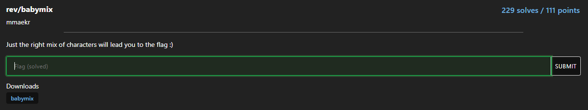
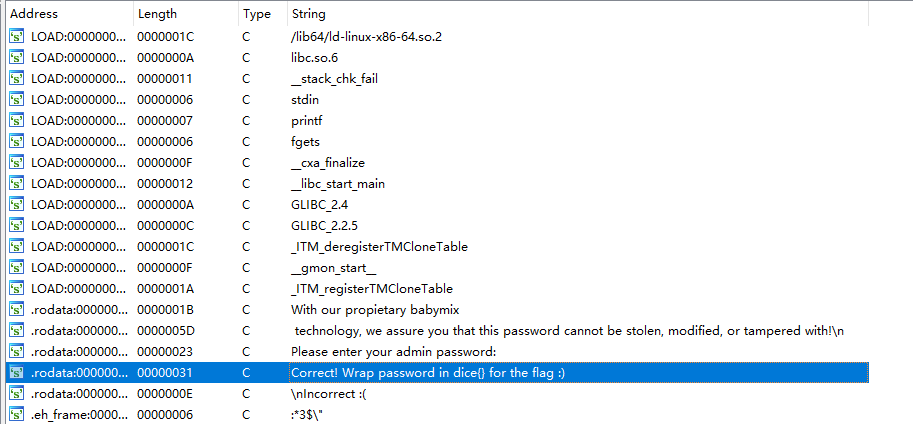
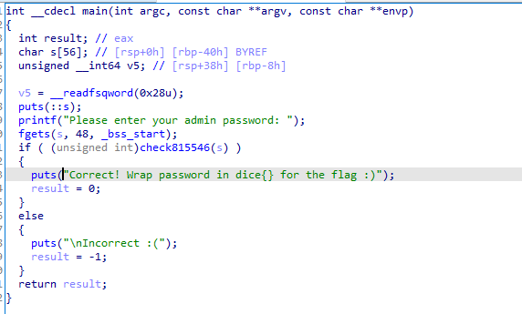
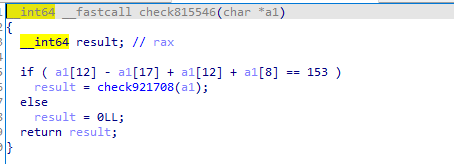
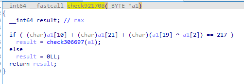
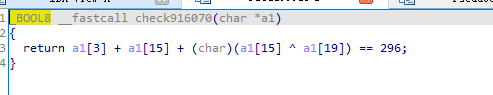

| 标题    | 类型 |
| ------- | ---- |
| babymix | re   |

### 题目



### 解题

将文件下载后，拖入IDA64后，查看字符串（shift+F12）

选中**Correct! Wrap password in dice{} for the flag :)**



调转至代码段，F5反编译后如下：



可见如果check815546(s)==True时，说明我们输入的s为flag。

进入check815546函数



代码简单，需要我们输入的字符串满足**a1[12] - a1[17] + a1[12] + a1[8] == 153**

继续进入check921708函数



后面的函数也类似，也是需要我们的字符串中的某些字符满足等式。

最后一个等式，当这些等式都满足时上层函数才能返回True



我们将所有等式列出来

```
a1[3]+a1[15]+(a1[15] ^ a1[19]) == 296
a1[19]-a1[7]+a1[0]+a1[16]+a1[11]+a1[17] == 361
a1[6]-a1[14]+a1[9]-a1[2]+a1[8]-a1[15]+a1[21]-a1[11] == -109
(a1[5] ^ a1[3])+a1[12]-a1[11]+(a1[6] ^ a1[4]) == 29
a1[6]-a1[13]+(a1[10] ^ a1[15])+a1[21]-a1[5] == -48
(a1[18] ^ a1[19])+a1[6]-a1[16]+(a1[5] ^ a1[16]) == 102
a1[11]-a1[21]+a1[12]-a1[10] == 36
a1[3]-a1[17]+a1[19]+a1[4]+(a1[12] ^ a1[17])+a1[10]-a1[2] == 160
a1[13]-a1[8]+a1[10]-a1[20]+a1[3]-a1[17] == 85
a1[0]-a1[15]+a1[20]+a1[18] == 156
a1[19]+a1[10]+a1[10]+a1[19]+a1[0]-a1[20]+a1[3]-a1[18] == 297
a1[16]-a1[14]+(a1[0] ^ a1[11])+(a1[0] ^ a1[14])+a1[13]-a1[19] == 106
a1[8]-a1[3]+(a1[14] ^ a1[2])+a1[11]+a1[0]+a1[1]-a1[19] == 283)
(a1[10] ^ a1[2])+a1[2]+a1[7]+a1[20] +a1[13]+(a1[3] ^ a1[16])+a1[9]+a1[6] == 621
a1[21]-a1[19]+a1[7]-a1[18]+a1[16]-a1[21]+(a1[12] ^ a1[18]) == 75
a1[5]-a1[18]+a1[17]-a1[4]+a1[15]+a1[2]+a1[21]-a1[18]+a1[7]+a1[6] == 250
a1[4]-a1[0]+a1[2]-a1[4]+a1[15]-a1[21]+a1[17]+a1[2] == 265
a1[8]-a1[17]+a1[14]-a1[3]+(a1[8] ^ a1[14]) +      a1[5]+a1[1]+a1[7]+a1[10] == 384
a1[4]-a1[16]+(a1[2] ^ a1[7]) == 77
(a1[19] ^ a1[13])+a1[6]-a1[13]+a1[17]-a1[11]+(a1[16] ^ a1[12]) == 85
a1[5]-a1[16]+a1[8]-a1[12]+a1[17]-a1[13]+a1[11]-a1[2]+a1[1]+a1[21] == 98
a1[14]+a1[10]+a1[18]-a1[9]+a1[5]+a1[10] == 413
a1[17]-a1[1]+a1[4]+a1[11]+a1[17]-a1[9] == 166
a1[10]-a1[8]+a1[2]-a1[19] == 74
a1[10]+a1[3]+a1[3]-a1[19]+(a1[19] ^ a1[0]) == 328
(a1[5] ^ a1[16])+a1[16]+a1[3]+(a1[0] ^ a1[16]) == 232
a1[10]+a1[21]+(a1[19] ^ a1[2]) == 217
a1[12] - a1[17]  +a1[12]+ a1[8] == 153
```

我们需要求解这些等式，需要用到**Z3 约束求解器**.(安装与使用详见文后的链接)

编写脚本

```python
from z3 import *
s = Solver()
a1 = [BitVec('a1[%d]' % i, 8) for i in range(0, 22)]
s.add(a1[3]+a1[15]+(a1[15] ^ a1[19]) == 296)
s.add(a1[19]-a1[7]+a1[0]+a1[16]+a1[11]+a1[17] == 361)
s.add(a1[6]-a1[14]+a1[9]-a1[2]+a1[8]-a1[15]+a1[21]-a1[11] == -109)
s.add((a1[5] ^ a1[3])+a1[12]-a1[11]+(a1[6] ^ a1[4]) == 29)
s.add(a1[6]-a1[13]+(a1[10] ^ a1[15])+a1[21]-a1[5] == -48)
s.add((a1[18] ^ a1[19])+a1[6]-a1[16]+(a1[5] ^ a1[16]) == 102)
s.add(a1[11]-a1[21]+a1[12]-a1[10] == 36)
s.add(a1[3]-a1[17]+a1[19]+a1[4]+(a1[12] ^ a1[17])+a1[10]-a1[2] == 160)
s.add(a1[13]-a1[8]+a1[10]-a1[20]+a1[3]-a1[17] == 85)
s.add(a1[0]-a1[15]+a1[20]+a1[18] == 156)
s.add(a1[19]+a1[10]+a1[10]+a1[19]+a1[0]-a1[20]+a1[3]-a1[18] == 297)
s.add(a1[16]-a1[14]+(a1[0] ^ a1[11])+(a1[0] ^ a1[14])+a1[13]-a1[19] == 106)
s.add(a1[8]-a1[3]+(a1[14] ^ a1[2])+a1[11]+a1[0]+a1[1]-a1[19] == 283)
s.add((a1[10] ^ a1[2])+a1[2]+a1[7]+a1[20] +
      a1[13]+(a1[3] ^ a1[16])+a1[9]+a1[6] == 621)
s.add(a1[21]-a1[19]+a1[7]-a1[18]+a1[16]-a1[21]+(a1[12] ^ a1[18]) == 75)
s.add(a1[5]-a1[18]+a1[17]-a1[4]+a1[15]+a1[2]+a1[21]-a1[18]+a1[7]+a1[6] == 250)
s.add(a1[4]-a1[0]+a1[2]-a1[4]+a1[15]-a1[21]+a1[17]+a1[2] == 265)
s.add(a1[8]-a1[17]+a1[14]-a1[3]+(a1[8] ^ a1[14]) +
      a1[5]+a1[1]+a1[7]+a1[10] == 384)
s.add(a1[4]-a1[16]+(a1[2] ^ a1[7]) == 77)
s.add((a1[19] ^ a1[13])+a1[6]-a1[13]+a1[17]-a1[11]+(a1[16] ^ a1[12]) == 85)
s.add(a1[5]-a1[16]+a1[8]-a1[12]+a1[17]-a1[13]+a1[11]-a1[2]+a1[1]+a1[21] == 98)
s.add(a1[14]+a1[10]+a1[18]-a1[9]+a1[5]+a1[10] == 413)
s.add(a1[17]-a1[1]+a1[4]+a1[11]+a1[17]-a1[9] == 166)
s.add(a1[10]-a1[8]+a1[2]-a1[19] == 74)
s.add(a1[10]+a1[3]+a1[3]-a1[19]+(a1[19] ^ a1[0]) == 328)
s.add((a1[5] ^ a1[16])+a1[16]+a1[3]+(a1[0] ^ a1[16]) == 232)
s.add(a1[10]+a1[21]+(a1[19] ^ a1[2]) == 217)
s.add(2 * a1[12] - a1[17] + a1[8] == 153)

print(s.check())
answer = s.model()
print(answer)
print(len(answer))
flag = ""
for i in range(0, 22):
    flag += chr(answer[a1[i]].as_long().real)
print(flag)
```

{}

dice{m1x_it_4ll_t0geth3r!1!}

{}


### 参考：

https://www.cnblogs.com/lxy8584099/p/12924357.html

https://www.freebuf.com/articles/web/232002.html

https://zhuanlan.zhihu.com/p/30548907

https://www.cnblogs.com/palmer0801/p/12111811.html

https://www.jianshu.com/p/64d87659673a