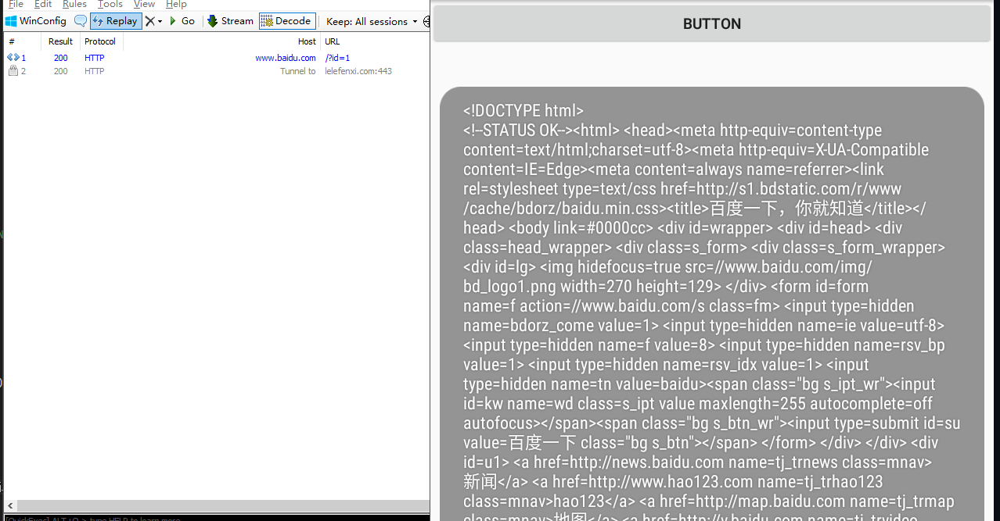
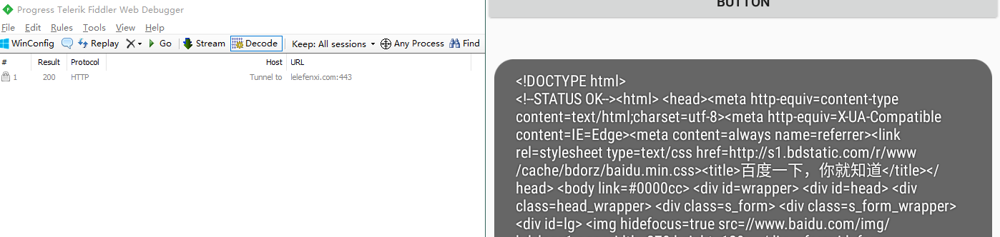
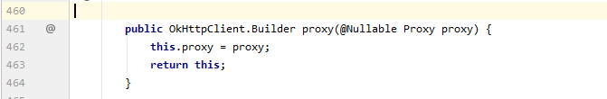
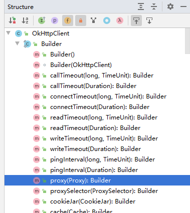
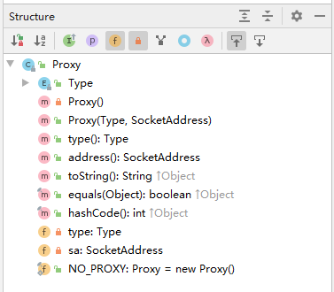
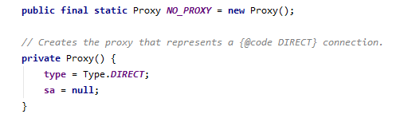
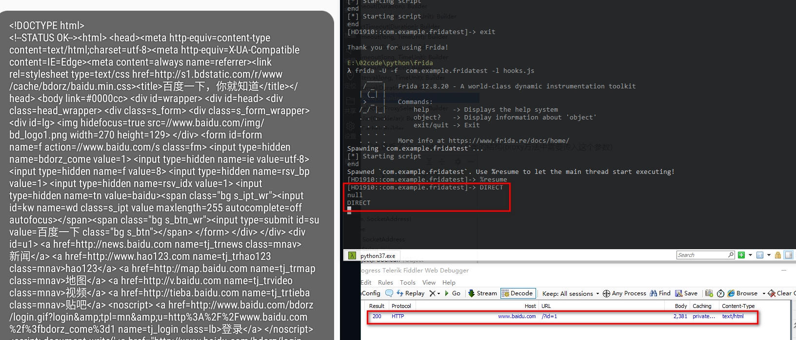

#### 0x1 开始
有一天交流时抛出一个问题，有没有遇到过apk在网络交互过程中，burpsuite和fiddler等抓包工具，无法抓取数据包，是否知道原因，以及如何解决？
今天就把这坑给填了


#### 0x2 示例1

OKHttp3是一个当前主流的网络请求的开源框架，我们就用这个框架来进行说明
首先我们构建一个简单的demo

```java
package com.example.fridatest;

import androidx.annotation.RequiresApi;
import androidx.appcompat.app.AppCompatActivity;

import android.os.Build;
import android.os.Bundle;
import android.os.Looper;
import android.view.View;
import android.widget.Toast;
import java.io.IOException;
import okhttp3.OkHttpClient;
import okhttp3.Request;
import okhttp3.Response;

import java.net.Proxy;
import java.util.Objects;

public class MainActivity extends AppCompatActivity {
    @Override
    protected void onCreate(Bundle savedInstanceState) {
        super.onCreate(savedInstanceState);
        setContentView(R.layout.activity_main);

        this.findViewById(R.id.button).setOnClickListener(new View.OnClickListener() {
            @RequiresApi(api = Build.VERSION_CODES.KITKAT)
            @Override
            public void onClick(View v) {
                new Thread(new Runnable(){
                    @Override
                    public void run() {
                        Looper.prepare();
                        OkHttpClient okHttpClient = new OkHttpClient.Builder().
                                build();
                        Request request = new Request.Builder()
                                .url("http://www.baidu.com/?id=1")
                                .build();
                        Response response = null;
                        try {
                            response = okHttpClient.newCall(request).execute();
                            String ss= Objects.requireNonNull(response.body()).string();
                            System.out.println(ss);
                            Toast.makeText(MainActivity.this,ss,Toast.LENGTH_SHORT).show();

                        } catch (IOException e) {
                            e.printStackTrace();
                        }
                        Looper.loop();
                    }
                }).start();
            }
        });

    }

}
```

apk功能很简单，提供一个按钮，点击后访问url(http://www.baidu.com/?id=1),弹窗显示Response。

运行app，并点击按钮后可见下图



可以看到请求发出，并被抓包工具记录

#### 0x3 2
我们给示例1修改下，添加上no_proxy
```java
package com.example.fridatest;

import androidx.annotation.RequiresApi;
import androidx.appcompat.app.AppCompatActivity;

import android.os.Build;
import android.os.Bundle;
import android.os.Looper;
import android.view.View;
import android.widget.Toast;
import java.io.IOException;
import okhttp3.OkHttpClient;
import okhttp3.Request;
import okhttp3.Response;

import java.net.Proxy;
import java.util.Objects;

public class MainActivity extends AppCompatActivity {
    @Override
    protected void onCreate(Bundle savedInstanceState) {
        super.onCreate(savedInstanceState);
        setContentView(R.layout.activity_main);

        this.findViewById(R.id.button).setOnClickListener(new View.OnClickListener() {
            @RequiresApi(api = Build.VERSION_CODES.KITKAT)
            @Override
            public void onClick(View v) {
                new Thread(new Runnable(){
                    @Override
                    public void run() {
                        Looper.prepare();
                        OkHttpClient okHttpClient = new OkHttpClient.Builder().
                                proxy(Proxy.NO_PROXY).//添加proxy属性
                                build();
                        Request request = new Request.Builder()
                                .url("http://www.baidu.com/?id=1")
                                .build();
                        Response response = null;
                        try {
                            response = okHttpClient.newCall(request).execute();
                            String ss= Objects.requireNonNull(response.body()).string();
                            System.out.println(ss);
                            Toast.makeText(MainActivity.this,ss,Toast.LENGTH_SHORT).show();

                        } catch (IOException e) {
                            e.printStackTrace();
                        }
                        Looper.loop();
                    }
                }).start();
            }
        });

    }

}
```
同样运行apk，查看结果

此时的结果显示，请求成功，但抓包工具没改请求记录，说明数据未经过代理。

#### 0x3 如何绕过

1. PC端配置反向代理，手机端通过修改hosts文件强行转流量，因为之前的测试中配置过（详细的原理和配置可参见《泄露的网站证书和私钥？来做些有趣的事吧！》）
    需要知道apk在交互过程中涉及到的域名。

2. hook对应的函数。
    本次我们已此为准。我们尝试用frida hook掉proxy函数

我们先找到proxy函数的位置，通过android Studio可以轻松实现
```okhttp-3.14.0.jar!\okhttp3\OkHttpClient.class:461```
   

从类结构来看，可以看到这个方法处于OkHttpClient这个类的一个叫Builder的内部类中



利用同样的方式，我们也查看了Java.net.Proxy这个类的结构(proxy方法中需要传入这个参数)

​												
然后可看到`NO_PROXY`这个参数实际上的内容如下



鉴于以上内容，我们需要hook OkHttpClient的Builder内部类的proxy方法。将参数修改成null即可。
最终的脚本如下
```java
console.log("[*] Starting script");
Java.perform(function () {
    var ss = Java.use("okhttp3.OkHttpClient$Builder");

    ss.proxy.implementation = function (x) {
        console.log(x.type())
        console.log(x.address())
        console.log(x)
        //以上打印的是java.net.proxy中附带的方法。具体看查看源码
        return this.proxy(null)
    }
});
console.log("end");
```
最终运行结果如下，成功让代理获取到数据
