### 序
今天我们利用codeql分析下“cookie未启用httponly“这类的安全问题，由此加深自己对codeql的使用

分析go程序时必须额外下载[codeql-go](https://github.com/github/codeql-go)

### 审计对象与目的

审计对象我们用[Vulnerability-goapp](https://github.com/Snow-HardWolf/Vulnerability-goapp)
因为该项目中的所有cookie均未设置http-only，没有对比性，所以我们先要对其修改。在一些cookie设置中添加上http-only，修改记录如下

pkg\admin\admin.go修改如下
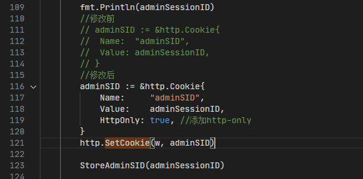

pkg\login\login.go修改如下
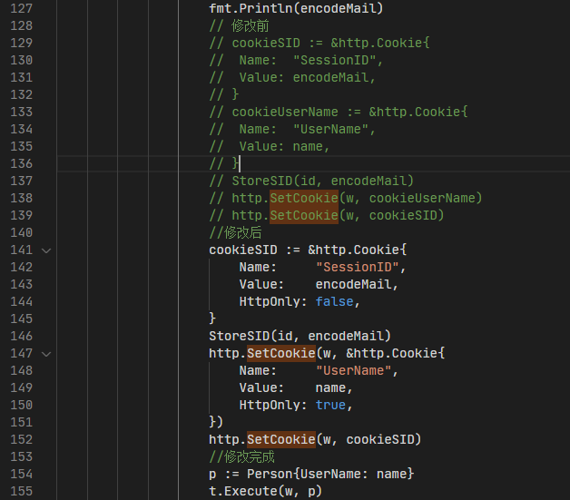

pkg\register\register.go修改如下
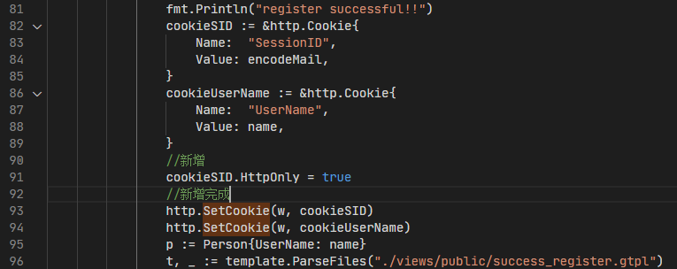

修改后记得重新生成一次database（如果需要覆盖旧的DATabase的话，则需要先删除旧的再生成新的

我们的目的就是通过codeql脚本来发现其中未设置httponly和设置了httponly的但httponly的值为false（一般不会这样，但保不齐有）的这样存在漏洞的点。


### 确定Source和Sink
Sink很简单，设置Cookie时，需要用到http.SetCookie方法,而需要设置的Cookie值是这个函数的第二个参数，然后我们可以写出找到类似这样Sink的查询语句
```
import go
from DataFlow::Node sink
where exists(DataFlow::CallNode c |
      c.getTarget().hasQualifiedName("net/http", "SetCookie") and c.getArgument(1) = sink
    )
select sink
```


运行后可获得以下结果，点击任意条目都会跳转到复合要求的代码段下
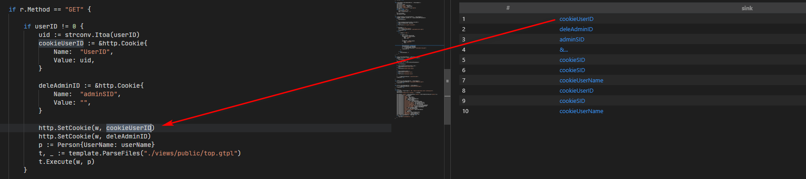

我们将其转换成一个Sink类，如下
```
private class Sink extends DataFlow::Node {
  Sink() {
    exists(DataFlow::CallNode c |
      c.getTarget().hasQualifiedName("net/http", "SetCookie") and c.getArgument(1) = this
    )
  }
}
```
这样之后我们通过将一个变量定义成Sink的话，就是指符合条件的所有代码片段，例如：
```
import go

private class Sink extends DataFlow::Node {
  Sink() {
    exists(DataFlow::CallNode c |
      c.getTarget().hasQualifiedName("net/http", "SetCookie") and c.getArgument(1) = this
    )
  }
}

from Sink s
select s

```
运行后会获得同样的结果


然后我们再来确定Source,从http.SetCookie方法接收的参数来看，实际第二个参数是接收一个Cookie的结构体
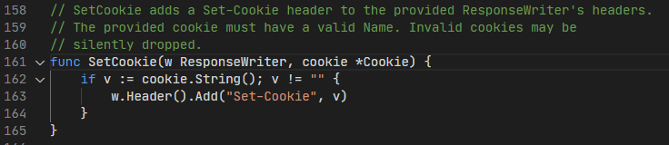

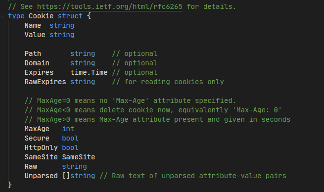


所以我们先要找到这样一个结构体，我们可以先把项目中所有的结构体列出来
codeql-go中关于结构体的定义如下
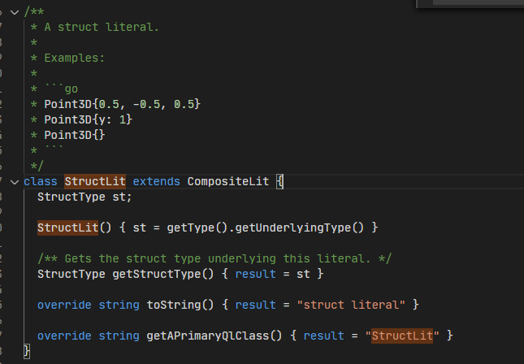

所以我们的查询脚本例如
```
import go

from StructLit source
select source

```

也如我们预期的一样列出了所有的结构体
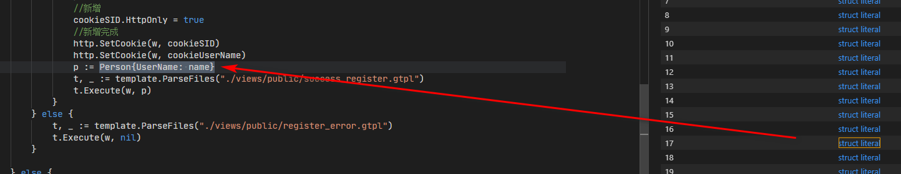

然后接下来就是剔除其他不相干的内容,对类型做限制

关于hasQualifiedName方法，在各种Codeql-go中的各种类型都有相同的方法，定义如下，标记对象的是在属于哪个包，叫什么名。
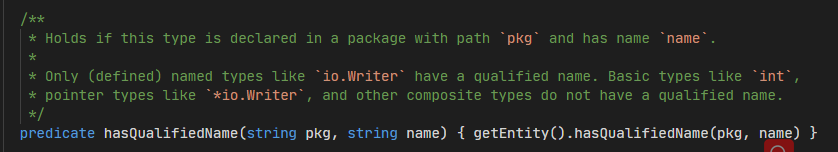

如果不确定的话，可以通过，getPackage和getName打印相关字段,例如
```
import go

from StructLit source
// where source.getType().hasQualifiedName("net/http", "Cookie")
select source.getType().getPackage(), source.getType().getName()

```
结果如下
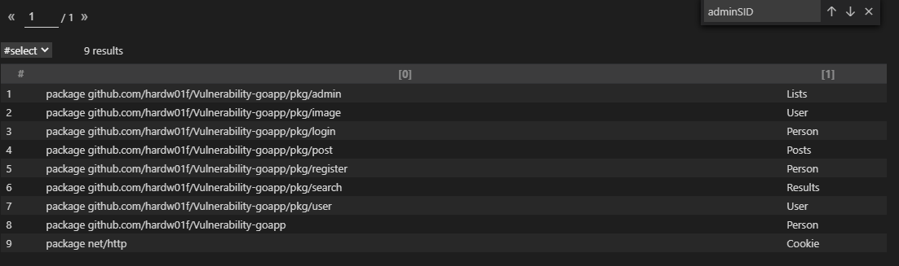


我们可以找到source定义，例如
```
import go

from StructLit source
where source.getType().hasQualifiedName("net/http", "Cookie")
select source

```
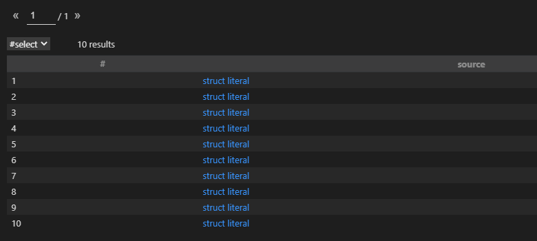
同样转换成DataFlow::Node的子类
```
private class Source extends DataFlow::Node {
  Source() {
    exists(StructLit s | s.getType().hasQualifiedName("net/http", "Cookie") and this.asExpr() = s)
  }
}
```
### TaintConfig定义

有了Source和Sink，简单定义TaintConfig，就能获得所有从Source到Sink的数据流

```
import go

private class Source extends DataFlow::Node {
  Source() {
    exists(StructLit s | s.getType().hasQualifiedName("net/http", "Cookie") and this.asExpr() = s)
  }
}

private class Sink extends DataFlow::Node {
  Sink() {
    exists(DataFlow::CallNode c |
      c.getTarget().hasQualifiedName("net/http", "SetCookie") and c.getArgument(1) = this
    )
  }
}

class Configuration extends TaintTracking::Configuration {
  Configuration() { this = "HttpOnly" }

  override predicate isSource(DataFlow::Node source) { source instanceof Source }

  override predicate isSink(DataFlow::Node sink) { sink instanceof Sink }
}

from Configuration cfg, DataFlow::PathNode source, DataFlow::PathNode sink
where cfg.hasFlowPath(source, sink)
select source, sink

```
结果如下：
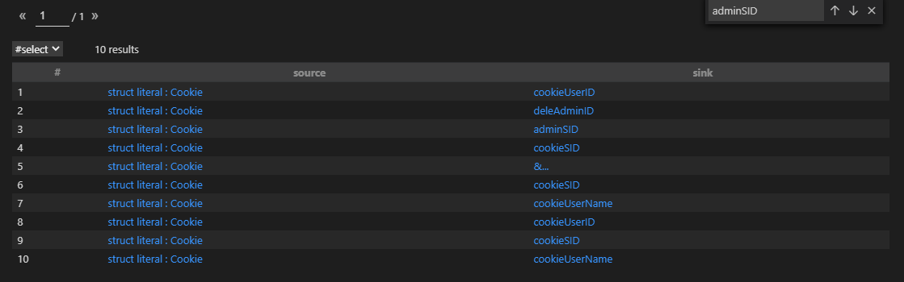

但是还没完，我们并没有将设置了httponly=true的部分给剔除。所以需要增加限定，就是将给HttpOnly字段设置了true的数据流，从结果中剔除。

我们可以 CodeQL 提供的 TaintTracking::isSanitizer，来过滤无害节点：
```
override predicate isSanitizer(DataFlow::Node node) {
    exists(Write w, Field f, DataFlow::Node rhs |
      f.hasQualifiedName("net/http", "Cookie", "HttpOnly") and
      w.writesField(node, f, rhs) and
      rhs.getBoolValue() = true
    )
  }
```
运行结果如下，有一处地方需要注意
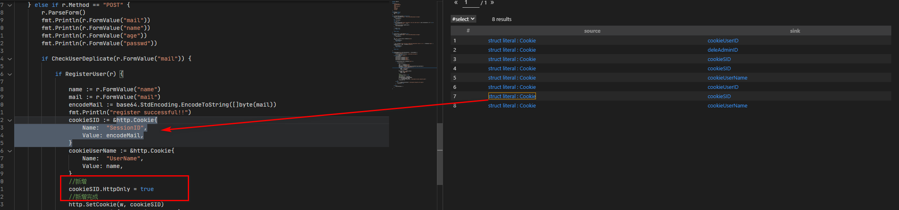
红框中实际有对HttpOnly进行设置，但我们的脚本并不能识别这样的一个数据流。后面试了各种方法，最终找到一种解决方式，将isSanitizer修改成以下内容

```
override predicate isSanitizer(DataFlow::Node node) {
    exists(Write w, Field f, DataFlow::Node n, DataFlow::Node rhs |
      f.hasQualifiedName("net/http", "Cookie", "HttpOnly") and
      w.writesField(n, f, rhs) and
      rhs.getBoolValue() = true and
      node = n.getAPredecessor*()n
    )
  }
```
其中`node=n.getAPredecessor*()`是说node是n的前置数据流节点，数据可以在0个或多个步骤中从node流到n。

### 最终脚本
加上一些信息，模仿官方的示例，最终脚本如下
```
/**
 * @name Cookie未设置httponly
 * @description Cookies包含一个HTTPOnly的设置选项，可以使此cookie不能被js读取，而只能用于HTTP请求。
 * @kind path-problem
 * @problem.severity error
 * @precision low
 * @id go/Cookie-not-set-httponly
 * @tags security
 */

import go
import DataFlow::PathGraph

private class Source extends DataFlow::Node {
  Source() {
    exists(StructLit s | s.getType().hasQualifiedName("net/http", "Cookie") and this.asExpr() = s)
  }
}

private class Sink extends DataFlow::Node {
  Sink() {
    exists(DataFlow::CallNode c |
      c.getTarget().hasQualifiedName("net/http", "SetCookie") and c.getArgument(1) = this
    )
  }
}

class Configuration extends TaintTracking::Configuration {
  Configuration() { this = "HttpOnly" }

  override predicate isSource(DataFlow::Node source) { source instanceof Source }

  override predicate isSink(DataFlow::Node sink) { sink instanceof Sink }

  override predicate isSanitizer(DataFlow::Node node) {
    exists(Write w, Field f, DataFlow::Node n, DataFlow::Node rhs |
      f.hasQualifiedName("net/http", "Cookie", "HttpOnly") and
      w.writesField(n, f, rhs) and
      rhs.getBoolValue() = true and
      node = n.getAPredecessor*()
    )
  }
}

from Configuration cfg, DataFlow::PathNode source, DataFlow::PathNode sink
where cfg.hasFlowPath(source, sink)
select sink.getNode(), source, sink, "Cookie-not-set-httponly in $@.", source.getNode(), "here"


```
最终筛选出存在问题的内容。
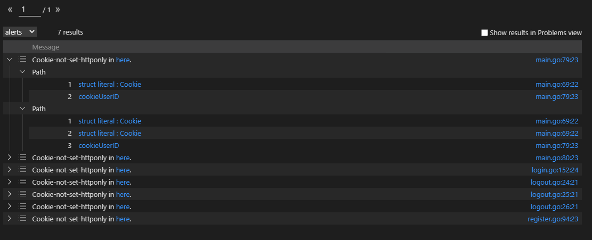