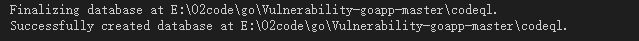
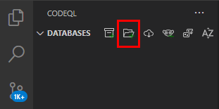
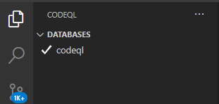
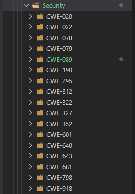
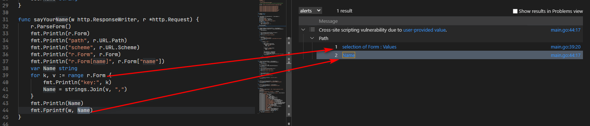
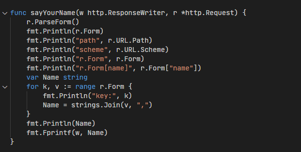

### 目的

学习codeql，并用其对Vulnerability-goapp进行审计

### 前期准备
1. 安装codeql
2. 获取codeql-go
3. 安装vscode的codeql插件并配置
4. 搭建待测平台用于验证问题
### 生成database

在Vulnerability-goapp项目的根目录下执行以下命令生成database
```
codeql database create ./codeql -s --language=go
```
这样就算创建成功了

如果对项目源码进行了修改，则需要删除该文件夹，并重新运行以上命令才能将修改的部分同步到数据库中
### 导入database
用插件导入database

选中我们刚创建的文件夹即可

以上我们成功设置了codeql和对应项目的信息，接下来就可以进行执行codeql脚本了

### codeql-go
codeql-go 自带了一些示例和一些常见漏洞的验证脚本
示例：codeql-go\ql\example
漏洞验证脚本（内涵存在对应的漏洞的代码文件)：codeql-go\ql\src\Security

包括有
CWE-078：命令注入
CWE-079：反射型XSS
CWE-089：SQL注入
等等

我们现在就以Vulnerability-goapp为例，来看看实际效果（仅对go语言为主，js的就不看了）

|漏洞类型|是否已有脚本|是否支持|
|----|----|----|
|命令注入|是|支持|
|空指针|是|支持|
|用户隐私泄露|是|支持|
|反射型XSS|是|支持|
|SQL注入|有|否|
|Cookie未启用httpOnly|否|否|
|不安全的传输方式|否|否|
|任意文件上传|否|否|
|越权|否|否|
|服务器敏感信息泄露|否|否|
|存储型XSS|否|否|


### 反射型XSS
先来个简单的，反射型XSS
运行ReflectedXss.ql(codeql\go\ql\src\Security\CWE-079\ReflectedXss.ql)
```
/**
 * @name Reflected cross-site scripting
 * @description Writing user input directly to an HTTP response allows for
 *              a cross-site scripting vulnerability.
 * @kind path-problem
 * @problem.severity error
 * @precision high
 * @id go/reflected-xss
 * @tags security
 *       external/cwe/cwe-079
 *       external/cwe/cwe-116
 */

import go
import semmle.go.security.ReflectedXss::ReflectedXss
import DataFlow::PathGraph

from Configuration cfg, DataFlow::PathNode source, DataFlow::PathNode sink
where cfg.hasFlowPath(source, sink)
select sink.getNode(), source, sink, "Cross-site scripting vulnerability due to $@.",
  source.getNode(), "user-provided value"

```
运行结果：


可以看到数据源和对应的接收器;程序在接收到用户提交的数据后，通过fmt.Fprintf方法写入的一个http.ResponseWriter对象中，导致了反射型XSS

我们简单的查看下source和sink的定义


所以需要我们自己写
存在漏洞的代码如下
Name是由用户提交上来的数据拼接成的，然后用fmt.Fprintf直接写入到http.ResponseWriter中


Codeql脚本的套路模板
```
class OgnlTaintTrackingCfg extends DataFlow::Configuration {
  OgnlTaintTrackingCfg() {
    this = "mapping"
  }

  override predicate isSource(DataFlow::Node source) {
    //判断
  }

  override predicate isSink(DataFlow::Node sink) {
    //判断
  }
  //非必须，
  override predicate isAdditionalFlowStep(DataFlow::Node node1, DataFlow::Node node2) {
    TaintTracking::localTaintStep(node1, node2) or
    exists(Field f, RefType t | node1.asExpr() = f.getAnAssignedValue() and node2.asExpr() = f.getAnAccess() and
      node1.asExpr().getEnclosingCallable().getDeclaringType() = t and
      node2.asExpr().getEnclosingCallable().getDeclaringType() = t
    )
  }
}

// 最后是执行查询（好像基本都是这个套路）
from OgnlTaintTrackingCfg cfg, DataFlow::Node source, DataFlow::Node sink
where cfg.hasFlow(source, sink)
select source, sink

```

补充反射型xss
ql\src\semmle\go\security\ReflectedXssCustomizations.qll

```
class HttpResponseBodySink extends Sink, HTTP::ResponseBody {
    HttpResponseBodySink() { not nonHtmlContentType(this) }
  }
//变成
class HttpResponseBodySink extends Sink, HTTP::ResponseBody {
    HttpResponseBodySink() { not nonHtmlContentType(this) or
      exists(DataFlow::CallNode call | call.getTarget().hasQualifiedName("fmt", "Fprintf") |
        this = call.getArgument(1)
      ) }
  }
```


### 修饰符

abstract一般用来修饰类和方法。
1.abstract修饰类
abstract修饰类，会使得类变成抽象类，抽象类不能生成实例，但是可以作为对象变量声明的类型，也就是编译时类型。抽象类相当于类的半成品，需要子类继承并覆盖其中的方法。
注意：

抽象类虽然不能实例化，但是有自己的构造方法。
抽象类和接口(interface)有很大的不同之处，接口中不能有实例方法去实现业务逻辑，而抽象类可以有实例方法，并实现业务逻辑。
抽象类不能被final修饰，因为被final修饰的类无法被继承，而对于抽象类来说就是需要通过继承去实现抽象方法。
2.abstract修饰方法
abstract修饰方法会使得这个方法变成抽象方法，也就是只有声明，而没有实现，需要子类重写。
注意：

有抽象方法的类一定是抽象类，但是抽象类不一定有抽象方法。
父类是抽象类，其中有抽象方法，那么子类继承父类，并把父类中的所有抽象方法都实现了，子类才有创建对象实例的能力，否则子类也必须是抽象类。抽象类中可以有构造方法，子类在构造子类对象时需要调用父类(抽象类)的构造方法。
抽象方法不能用private修饰，因为抽象方法必须被子类重写，而private权限对于子类来说是不能访问的，所以就会产生矛盾。
抽象方法也不能用static修饰，如果用static修饰了，那么我们就可以直接通过类名调用了，而抽象方法压根没有主体，没有任何业务逻辑，这样就毫无意义了。
我们沉积法

以命令注入为例
source为用户请求传入的参数
sink为exec.Command函数的第三个参数

```
import go

// import DataFlow::PathGraph
private class ParamsGet extends Method {
  ParamsGet() {
    this.hasQualifiedName("net/http", "Request", "FormValue") or
    this.hasQualifiedName("net/http", "Request", "Cookie") or
       this.hasQualifiedName("net/http", "Request", "Get") or
       this.hasQualifiedName("net/http", "Request", "Form") or
       this.hasQualifiedName("net/http", "Request", "PostForm") or
       this.hasQualifiedName("net/http", "Request", "MultiparForm") or
       this.hasQualifiedName("net/http", "Request", "Body")
  }
}

private class Source extends DataFlow::CallNode {
  Source() { this = any(ParamsGet p).getACall() }
}

private class Inp extends DataFlow::CallNode {
  Inp() { this.getTarget().hasQualifiedName("os/exec", "Command") }
}

private class Sink extends DataFlow::Node {
  Sink() { this = any(Inp p).getArgument(2) }
}

class Configuration extends TaintTracking::Configuration {
  Configuration() { this = "CommandInjection" }

  override predicate isSource(DataFlow::Node source) { source instanceof Source }

  override predicate isSink(DataFlow::Node sink) { sink instanceof Sink }
}

from Configuration cfg, DataFlow::PathNode source, DataFlow::PathNode sink
where cfg.hasFlowPath(source, sink)
select sink.getNode(), source, sink, "This command depends on $@.", source.getNode(),
  "a user-provided value"

```

### 常用变量和方法
DataFlow::ArgumentNode
作为调用中的参数出现的数据流节点，包括接收方参数
CallNode
表示调用的数据流节点


查找以mysql开头的字符串

### 基本漏洞审计
class Test extends DataFlow::Node {
  Test() { exists(string c | this.getStringValue() = c | c.substring(0, 5) = "mysql") }
}

from Test n, DataFlow::CallNode fileReader, DataFlow::CallNode call, Parameter p
// where
//   call.getTarget().hasQualifiedName("os/exec", "Command") and
//   DataFlow::localFlow(n, call.getArgument(2))
select n

以命令注入为例

```
import go

// import DataFlow::PathGraph
private class ParamsGet extends Method {
  ParamsGet() {
    this.hasQualifiedName("net/http", "Request", "FormValue") or
    this.hasQualifiedName("net/http", "Request", "Cookie")
  }
}

private class Source extends DataFlow::CallNode {
  Source() { this = any(ParamsGet p).getACall() }
}

private class Inp extends DataFlow::CallNode {
  Inp() { this.getTarget().hasQualifiedName("os/exec", "Command") }
}

private class Sink extends DataFlow::Node {
  Sink() { this = any(Inp p).getArgument(2) }
}

class Configuration extends TaintTracking::Configuration {
  Configuration() { this = "CommandInjection" }

  override predicate isSource(DataFlow::Node source) { source instanceof Source }

  override predicate isSink(DataFlow::Node sink) { sink instanceof Sink }
}

from Configuration cfg, DataFlow::PathNode source, DataFlow::PathNode sink
where cfg.hasFlowPath(source, sink)
select sink.getNode(), source, sink, "This command depends on $@.", source.getNode(),
  "a user-provided value"

```


### 补充漏洞脚本

### 常见脚本编写步骤

找sink
由sink找到source

字段读取、匹配判断语句
```
from DataFlow::Node s, DataFlow::CallNode c, DataFlow::Node n, ComparisonExpr comp
where
  s = any(Field f | f.hasQualifiedName("net/http", "Request", "Method")).getARead() and
  comp.getAnOperand() = s.asExpr() and
  comp.getAnOperand().getStringValue() = "POST"
select comp
```


### DataFlow
DataFlow::CallNode：如果调用系统函数的话，用Builtin::len()=>len()
### ControlFlow

