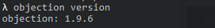
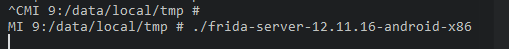
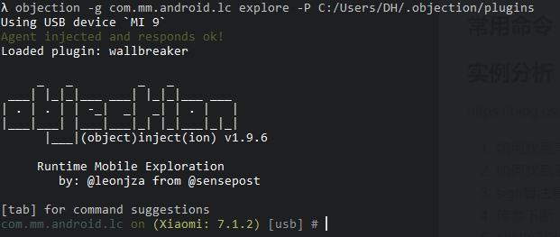
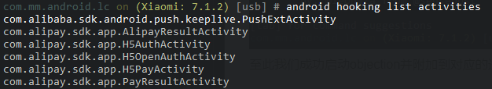
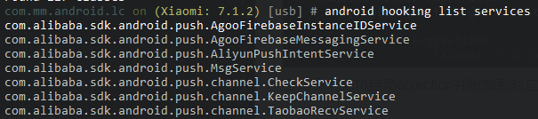
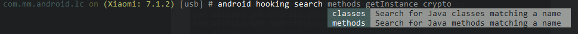
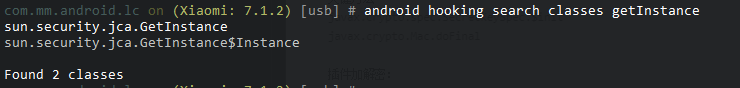
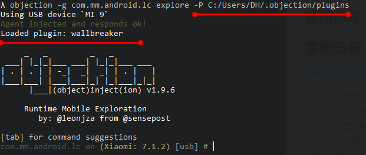
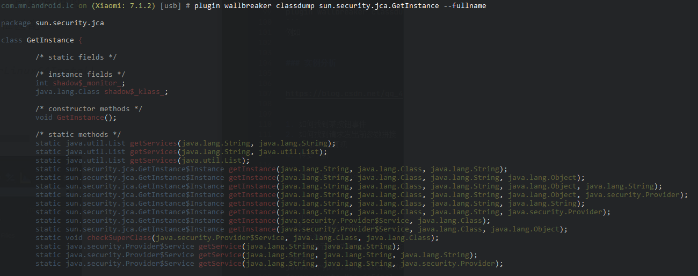

objection是基于frida的命令行hook工具，已内置了常用的hook方法，通过输入几句命令，可实现各项功能。
### 安装
需要先安装Frida
```
pip3 install frida
```
安装Frida-Tools
```
pip3 install frida-tools
```

安装Objection
```
pip3 install objection
```

安装完成后，输入`objection version`可验证是否安装成功


使用前还需要到[这里](https://github.com/frida/frida/releases)下载和当前Frida版本、环境架构一致的Frida-Server，并将其放到测试手机上。
### 启动
先启动手机上的Frida-Server

使用以下命令启动objection
```
objection -g [process] explore [-P PluginPath]
```

至此我们成功启动objection并附加到对应的进程中
### 常用命令
接下来我们将对常用的几个命令进行介绍
列出应用的所有activity
```
android hooking list activities
```

列出应用的所有server
```
android hooking list activities
```

还可以列`classes`和`class_methods`

根据关键字搜索class或class_methods

比如,搜索含有关键字getInstance的类
```
android hooking search classes getInstance
```


hook 方式
```
/*
hook指定方法, 如果有重载会hook所有重载,如果有疑问可以看
--dump-args : 打印参数
--dump-backtrace : 打印调用栈
--dump-return : 打印返回值
*/
android hooking watch class_method com.xxx.xxx.methodName --dump-args --dump-backtrace --dump-return

//hook指定类, 会打印该类下的所以调用
android hooking watch class com.xxx.xxx

//设置返回值(只支持bool类型)
android hooking set return_value com.xxx.xxx.methodName false
```

关闭app的ssl校验

```
android sslpinning disable
```
监控系统剪贴板
```

//获取Android剪贴板服务上的句柄并每5秒轮询一次用于数据。 如果发现新数据，与之前的调查不同，则该数据将被转储到屏幕上。
help android  clipboard
```
执行命令行
```
help android shell_exec [command]
```
### Plugins
如果在加载时附件里PluginPath，objection会自动加载plugins
例如


介绍下**wallbreaker**的使用（[下载地址](https://github.com/hluwa/Wallbreaker)）
可以看到android内存中的类结构、示例、内部数据等
```
plugin wallbreaker classdump com.xxxx.xxx --fullname
```
例如


