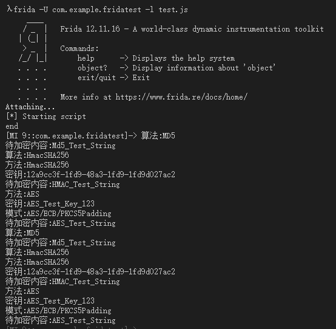
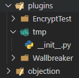
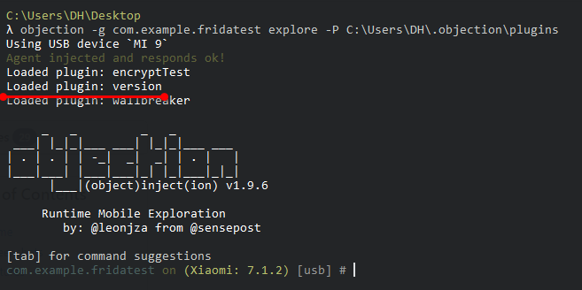
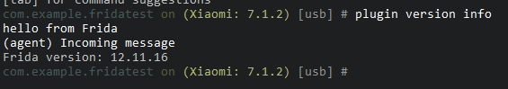
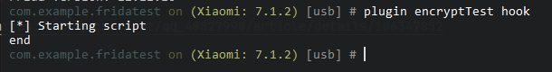
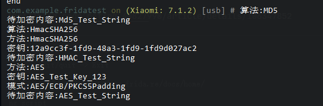

### 目的
写一个插件
### 功能
自动hook加解密的函数
### 需要哪些关键点
1. 自动hook
2. 自动将参数和返回结果中的byte数组转成字符串


### 实例分析

简单编写hook以下方法的frida脚本

```java
javax.crypto.spec.SecretKeySpec.$init
javax.crypto.Cipher.getInstance
javax.crypto.Cipher.doFinal
javax.crypto.Mac.getInstance
javax.crypto.Mac.doFinal
java.security.MessageDigest.getInstance
java.security.MessageDigest.digest
```
frida脚本
```js
console.log("[*] Starting script");
Java.perform(function () {
    var SecretKeySpecClass = Java.use("javax.crypto.spec.SecretKeySpec");

    var JavaString = Java.use("java.lang.String");
    SecretKeySpecClass.$init.overload('[B', 'java.lang.String').implementation = function (x, y) {
        console.log("方法:" + y);
        console.log("密钥:" + JavaString.$new(x));
        return this.$init(x, y)
    }

    var MacClass = Java.use("javax.crypto.Mac");
    var CipherClass = Java.use("javax.crypto.Cipher");
    var MessageClass = Java.use("java.security.MessageDigest")

    CipherClass.getInstance.overload("java.lang.String").implementation = function (x) {
        console.log("模式:" + x);
        return this.getInstance(x)
    }
    CipherClass.doFinal.overload('[B').implementation = function (x) {
        console.log("待加密内容:" + JavaString.$new(x));
        return this.doFinal(x)
    }
    MacClass.getInstance.overload("java.lang.String").implementation = function (x) {
        console.log("算法:" + x);
        return this.getInstance(x)
    }
    MacClass.doFinal.overload('[B').implementation = function (x) {
        console.log("待加密内容:" + JavaString.$new(x));
        return this.doFinal(x)
    }
    MessageClass.getInstance.overload("java.lang.String").implementation = function (x) {
        console.log("算法:" + x);
        return this.getInstance(x)
    }
    MessageClass.digest.overload('[B').implementation = function (x) {
        console.log("待加密内容:" + JavaString.$new(x));
        return this.digest(x)

    }
});
console.log("end");
```
脚本执行结果如下


接下来将frida脚本移植到objection工具中。
[官方文档](https://github.com/sensepost/objection/wiki/Plugins#example-plugins)
[实例插件](https://github.com/sensepost/objection/blob/master/tests/data/plugin/__init__.py)

下载示例后，在C:/Users/当前用户/.objection/plugins/下创建tmp文件夹，将示例放入



使用命令启动objection

```objection -g com.example.fridatest explore -P C:\Users\DH\.objection\plugins```


提示已加载version插件


输入命令
```
plugin version info
```



页面返回Frida版本号，说明插件运行成功


### 结合官方文档查看示例结构

`namespace`声明了插件名称

`plugin`该变量指明继承`objection.utils.plugin.Plugin`插件类的一个实例

插件中的两个变量

`self.script_src`:脚本内容

`self.script_path`脚本路径

二者选其一即可

完整的示例如下
```python
__description__ = "An example plugin, also used in a UnitTest"

from objection.utils.plugin import Plugin

s = """
rpc.exports = {
    getInformation: function() {
        console.log('hello from Frida');    // direct output
        send('Incoming message');           // output via send for 'message' signal
        return Frida.version;               // return type
    }
}
"""


class VersionInfo(Plugin):
    """ VersionInfo is a sample plugin to get Frida version information """

    def __init__(self, ns):
        """
            Creates a new instance of the plugin
            :param ns:
        """

        self.script_src = s
        # self.script_path = os.path.join(os.path.dirname(__file__), "script.js")

        implementation = {
            'meta': 'Work with Frida version information',//工具说明
            'commands': {//工具中的命令列表
                'info': {
                    'meta': 'Get the current Frida version',//命令说明
                    'exec': self.version    //命令执行时会调用的方法
                }
            }
        }

        super().__init__(__file__, ns, implementation)

        self.inject()

    def version(self, args: list):
        """
            Tests a plugin by calling an RPC export method
            called getInformation, and printing the result.
            :param args:
            :return:
        """

        v = self.api.get_information() //由rpc.export导出的方法
        print('Frida version: {0}'.format(v))


namespace = 'version'
plugin = VersionInfo

```
基于以上内容我们修改示例
```python
__description__ = "An example plugin, also used in a UnitTest"

from objection.utils.plugin import Plugin

s = """
rpc.exports = {
    getEncrypthook: function () {
        该函数内容是我们的frida脚本
        console.log("[*] Starting script");
        Java.perform(function () {
            var SecretKeySpecClass = Java.use("javax.crypto.spec.SecretKeySpec");

            var JavaString = Java.use("java.lang.String");
            SecretKeySpecClass.$init.overload('[B', 'java.lang.String').implementation = function (x, y) {
                console.log("方法:" + y);
                console.log("密钥:" + JavaString.$new(x));
                return this.$init(x, y)
            }

            var MacClass = Java.use("javax.crypto.Mac");
            var CipherClass = Java.use("javax.crypto.Cipher");
            var MessageClass = Java.use("java.security.MessageDigest")

            CipherClass.getInstance.overload("java.lang.String").implementation = function (x) {
                console.log("模式:" + x);
                return this.getInstance(x)
            }
            CipherClass.doFinal.overload('[B').implementation = function (x) {
                console.log("待加密内容:" + JavaString.$new(x));
                return this.doFinal(x)
            }
            MacClass.getInstance.overload("java.lang.String").implementation = function (x) {
                console.log("算法:" + x);
                return this.getInstance(x)
            }
            MacClass.doFinal.overload('[B').implementation = function (x) {
                console.log("待加密内容:" + JavaString.$new(x));
                return this.doFinal(x)
            }
            MessageClass.getInstance.overload("java.lang.String").implementation = function (x) {
                console.log("算法:" + x);
                return this.getInstance(x)
            }
            MessageClass.digest.overload('[B').implementation = function (x) {
                console.log("待加密内容:" + JavaString.$new(x));
                return this.digest(x)

            }
        });
        console.log("end");
    }
}
"""


class VersionInfo(Plugin):
    """ VersionInfo is a sample plugin to get Frida version information """

    def __init__(self, ns):
        """
            Creates a new instance of the plugin
            :param ns:
        """

        self.script_src = s
        # self.script_path = os.path.join(os.path.dirname(__file__), "script.js")

        implementation = {
            'meta': 'Work with Frida version information',
            'commands': {

                'hook': {//补充上我们的命令，以及需要调用的方法
                    'meta': 'hook 加密方法',
                    'exec': self.HookEncrypt
                }
            }
        }

        super().__init__(__file__, ns, implementation)

        self.inject()

    def HookEncrypt(self, args: list):
        """
            Tests a plugin by calling an RPC export method
            called getInformation, and printing the result.
            :param args:
            :return:
        """
        v = self.api.get_encrypthook()
        //该方法需要与上面js脚本中的rpc.exports中的方法对应，例如getEncrypthook=>get_encrypthook,如果是getVersion=>get_version。


namespace = 'encryptTest'
plugin = VersionInfo
```


以上脚本编写完成。

再次运行objection，并运行插件。



任意执行测试app中的加密后，工具返回结果



到这里我们就将我们的脚本移植到objection上了。

