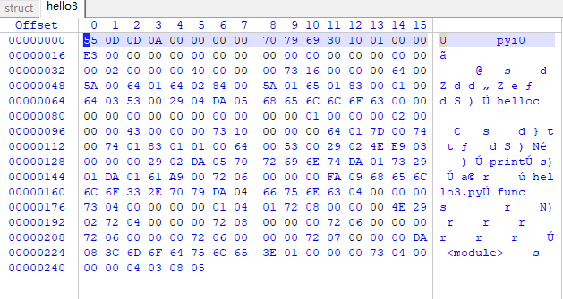

### 什么是python

python是一种解释型、面向对象、动态数据类型的高级程序设计语言

#### 解释型语言和编译型语言的区别

我们编程都是用的高级语言，计算机不能直接理解高级语言，只能理解和运行机器语言，所以必须要把高级语言翻译成机器语言，计算机才能运行高级语言所编写的程序。翻译的方式有两种，一个是编译，一个是解释。

用编译型语言写的程序执行之前，需要一个专门的编译过程，通过编译系统（不仅仅只是通过编译器，编译器只是编译系统的一部分）把高级语言翻译成机器语言（具体翻译过程可以参看下图），把源高级程序编译成为机器语言文件。

解释型语言没有严格编译汇编过程，由解释器将代码块按需要变运行边翻译给机器执行。因此解释型语言一度存在运行效率底，重复解释的问题。但是通过对解释器的优化!可以提高解释型语言的运行效率。Python就属于这一种编程语言。
{}

{}
#### python运行原理概述

Python是解释型语言，没有严格意义上的编译和汇编过程。但是一般可以认为编写好的python源文件，由python解释器翻译成以.pyc为结尾的字节码文件。pyc文件是二进制文件，可以由python虚拟机直接运行。

*注：有的朋友可能会问，为什么我运行python，有时候生成pyc文件，有时候没有呢？Python在执行import语句时，将会到已设定的path中寻找对应的模块。并且把对应的模块编译成相应的PyCodeObject（python中的一个类）中间结果，然后创建pyc文件，并将中间结果写入该文件。然后，Python会import这个pyc文件，实际上也就是将pyc文件中的PyCodeObject重新复制到内存中。而被直接运行的python代码一般不会生成pyc文件。*

加载模块时，如果同时存在.py和.pyc，Python会尝试使用.pyc，如果.pyc的编译时间早于.py的修改时间，则重新编译.py并更新.pyc。

### pyc文件结构

Python代码的编译结果就是PyCodeObject对象。PyCodeObject对象可以由虚拟机加载后直接运行，而pyc文件就是PyCodeObject对象在硬盘上的保存形式。因此我们先分析PyCodeObject对象的结构，随后再涉及pyc文件的二进制结构。

#### PyCodeObject对象结构分析

```c++
typedef struct {
    PyObject_HEAD
    int co_argcount;        /* 位置参数个数 */
    int co_nlocals;         /* 局部变量个数 */
    int co_stacksize;       /* 栈大小 */
    int co_flags;   
    PyObject *co_code;      /* 字节码指令序列 */
    PyObject *co_consts;    /* 所有常量集合 */
    PyObject *co_names;     /* 所有符号名称集合 */
    PyObject *co_varnames;  /* 局部变量名称集合 */
    PyObject *co_freevars;  /* 闭包用的的变量名集合 */
    PyObject *co_cellvars;  /* 内部嵌套函数引用的变量名集合 */
    /* The rest doesn’t count for hash/cmp */
    PyObject *co_filename;  /* 代码所在文件名 */
    PyObject *co_name;      /* 模块名|函数名|类名 */
    int co_firstlineno;     /* 代码块在文件中的起始行号 */
    PyObject *co_lnotab;    /* 字节码指令和行号的对应关系 */
    void *co_zombieframe;   /* for optimization only (see frameobject.c) */
} PyCodeObject;
```

pyc文件结构主要包括两部分：pyc文件头部表示和PyCodeObject对象部分。上面对PyCodeObject对象的二进制部分已经有了了解，pyc文件头部比较简单，在python2中只占用4个字节包含两个字段magic和mtime，完整的pyc文件结构见下图：

{}


{}

#### 实例分析

```python
s = "hello"          
def func():
    a = 3 
    print s
func()
```

通过执行python2 -m py_compile hello.py 可以生成编译好的pyc文件hello.pyc。

{}


{}

用二进制编辑器打开hello.pyc
{}

{}

- **pyc文件头部**
  - 前4个字节：03f3 0d0a，表示python版本
  - 5-8个字节：0e6b 905d，表示pyc文件修改时间

- **PyCodeObject对象二进制编译结果**
  - 第9字节：63，TYPE_CODE字段，也就是字符c，值为99，即0x63，表示接下为是一个PyCodeObject对象
- **PyCodeObject对象----全局参数**
  - 然后4个字节是0x00 0000 00，code block的位置参数个数co_argument，这里是0；
  - 再接着4个字节是0x00 0000 00， code block中的局部变量个数co_nlocals，这里是0；
  - 再接着4个字节是0x01 0000 00， code block需要的栈空间co_stacksize，这里是1；
  - 再接着4个字节是0x40 0000 00， co_flags，这里是64；
- **PyCodeObject对象----code block**
  - 1个字节0x73为TYPE_CODE字段， 表示该字段为string格式；
  - 4个字节0x1a00 0000表示code block段的数据部分占用0x1a个字节，即长度为26；
  - 接下来26个字节6400 ...... 6402 0053为该TYPE_CODE字段（数据类型string）部分，也就是pyc文件中包含的字节码指令
- **再往下的逐个TYPE_CODE字段都是重复结构的，用来表示PyCodeObject对象中的一些其他参数**

### 反编译由pyinstaller生成的exe

#### 0. 工具安装

- python3.x
- pyinstxtractor.py
- 安装uncompyle6使用命令：pip install uncompyle6 
- 测试exe：hello3.exe

#### 1. 将exe文件转化成pyc文件

​	输入一下命令

```
python pyinstxtractor.py hello3.exe
```
{}

{}
命令执行成功后，会在同级目录下生成一个新的文件夹hello3.exe_extracted

#### 2. 利用winhex修复pyc文件

找到其中的两个文件hello3和struct
{}

{}
用winhex同时打开以上两个文件
{}


{}
从struct上的标记出来的这一段字节复制到hello3中
{}

{}
最终的结果
{}

{}
将该文件保存成hello3.pyc

**复制黏贴多少字节，不同python版本、不同程序可能都存在差别。对比两个文件即可判断需要多少字节数据**

**主程序第一个字节是以什么开头的，然后找到struct这个字节前面的内容复制过来就可以了**

#### 3. 用**uncompyle6**将pyc反编译成py文件

输入命令

```
uncompyle6 hello3.pyc >hello.py
```
{}

{}
查看生成的hello.py文件内容
{}

{}
与原文件对比
{}

{}
至此，反编译成功。